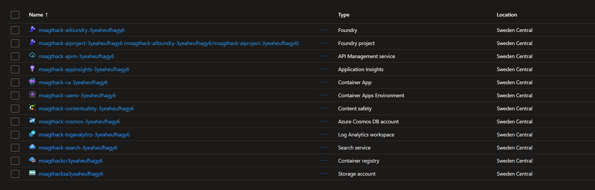
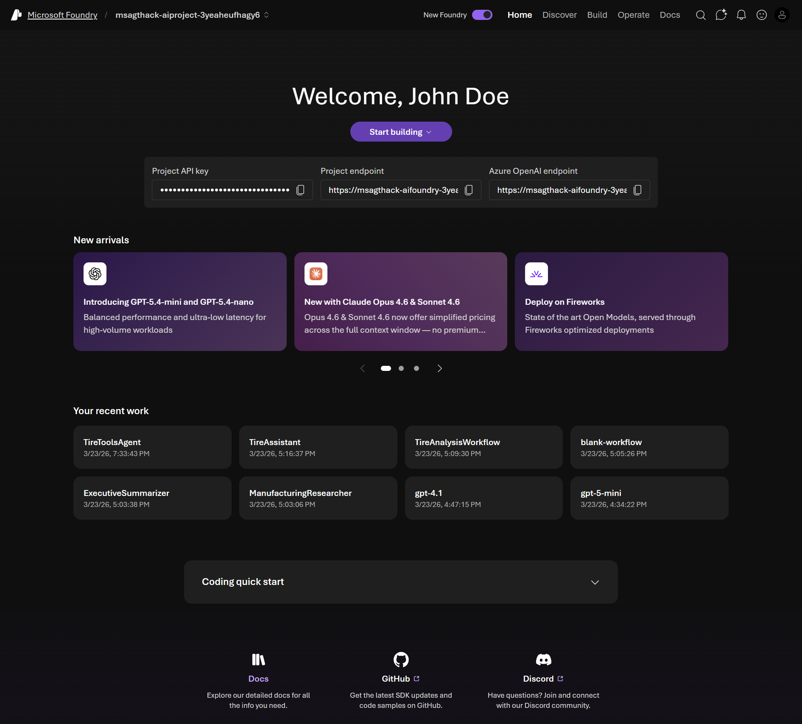
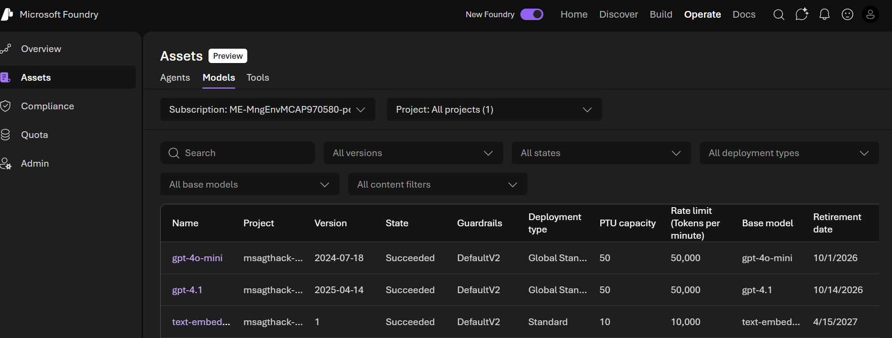

# Admin Lab 0: Environment Validation

← Home | **Admin Lab 0** | [Admin Lab 1 — Model Lifecycle →](../admin-lab-1/README.md)

Welcome to the first Admin Lab! This short exercise ensures you have access to all the Azure resources and the Foundry Portal needed for the remaining labs. Everything here is done in the browser — no code required.

**Expected duration**: 10 min

**Prerequisites**:

- An Azure account with access to the pre-created resource group

> [!NOTE]
> These Admin Labs are **self-contained** — you do not need to have completed the Portal Labs or Coding Challenges. All agents and resources are created fresh within each lab.

## 🎯 Objective

The goals for this lab are:

- Confirm you can access the Azure portal and identify the provisioned resources.
- Sign in to the Foundry Portal and navigate the pre-created project.
- Verify that the three pre-deployed models are available and ready.

## 🧭 Context and Background

The workshop environment is built around a **Contoso Tires** manufacturing scenario — a fictitious tire factory with machines, technicians, parts inventory, and maintenance workflows. The Admin Labs focus on the **governance, lifecycle, and operational** aspects of managing AI models and agents in Azure AI Foundry.

The environment provisioned includes resources you'll interact with across these labs:

| Resource | Purpose in Admin Labs |
|----------|----------------------|
| **AI Foundry** (project) | Central hub — models, agents, identity, management |
| **Storage Account** | Holds knowledge base files; connected via managed identity |
| **AI Search** | Powers knowledge retrieval; role assignments visible in IAM |
| **Cosmos DB** | Factory data store; reference context for agent testing |
| **Application Insights** | Agent tracing, monitoring dashboards, evaluation metrics |
| **Log Analytics** | Underlying log store for Application Insights queries |
| **API Management** | AI Gateway (used by coding challenges) |

> [!NOTE]
> Not all resources in the resource group are used in the admin labs. That's expected — some resources are specific to the coding challenges.

## ✅ Tasks

### Task 1: Explore Azure Resources

1. Open [portal.azure.com](https://portal.azure.com) in your browser and sign in.
2. Navigate to **Resource groups** and find the pre-created resource group for this workshop.
3. Review the list of resources. You should see at least:
   - An **Azure AI Foundry** resource (formerly Azure AI hub/project)
   - A **Storage Account**
   - An **AI Search** service
   - A **Cosmos DB** account
   - An **API Management** service
   - **Application Insights** / **Log Analytics**

**✅ You should see something similar to this**

A resource group containing ~12 resources.

### Task 2: Access the Foundry Portal

1. Open [ai.azure.com](https://ai.azure.com) in your browser and sign in with the same Azure account.
2. Ensure that the **New Foundry** portal experience is enabled — look for the **New Foundry** toggle in the upper-right corner and make sure it is turned **on**.
3. You should land on the **Foundry Portal** welcome page. Take a moment to orient yourself:
   - **Top navigation bar** — **Home**, **Discover**, **Build**, **Operate**, **Docs**
   - **Welcome banner** — Shows your name and a **Start building** button
   - **Project credentials** — Displays your **Project API key**, **Project endpoint**, and **Azure OpenAI endpoint**
   - **New arrivals** — Highlights newly available models and deployment options
4. Verify that your pre-created **project** is visible on the welcome page — you should see its credentials (API key, endpoint) displayed. If no project appears, ask your coach for help.

**✅ You should see something similar to this**

The Foundry Portal welcome page showing your name, the Start building button, project credentials, and the top navigation bar.

> [!TIP]
> If you see a "request access" or permission error, ask your coach for help. You may need to be added to the project's access control (IAM) in the Azure portal.

### Task 3: Confirm Model Deployments

1. In the Foundry Portal, click **Operate** in the top navigation bar, then select **Assets** → **Models** in the left sidebar.
2. Confirm you see three pre-deployed models:

| Model | Type | Expected Status |
|-------|------|-----------------|
| `gpt-4.1` | Chat completion | ✅ Succeeded |
| `gpt-4o-mini` | Chat completion | ✅ Succeeded |
| `text-embedding-3-large` | Embedding | ✅ Succeeded |

3. Click on one of the deployments to view its details: deployment name, model version, rate limits, and endpoint URL.

**✅ You should see something similar to this**

The Assets page under Operate showing three model deployments, all with state "Succeeded".

## 🛠️ Troubleshooting and FAQ

**I can't find the resource group in the Azure portal**

- Make sure you're signed in with the correct Azure account.
- Try searching for the resource group name in the top search bar.
- Check that your subscription filter (top-level filter bar) is not hiding the subscription.

**I get a permission error in the Foundry Portal**

- You need at least **Cognitive Services User** or **Contributor** role on the AI Foundry resource.
- Ask your coach to verify your role assignment in the Azure portal under the resource's **Access control (IAM)** blade.

## 🧠 Conclusion

You've confirmed access to:
- The Azure resource group with all provisioned resources
- The Foundry Portal project with no permission issues
- Three pre-deployed models ready for use

**Next**: [Admin Lab 1 — Model Lifecycle](../admin-lab-1/README.md)
