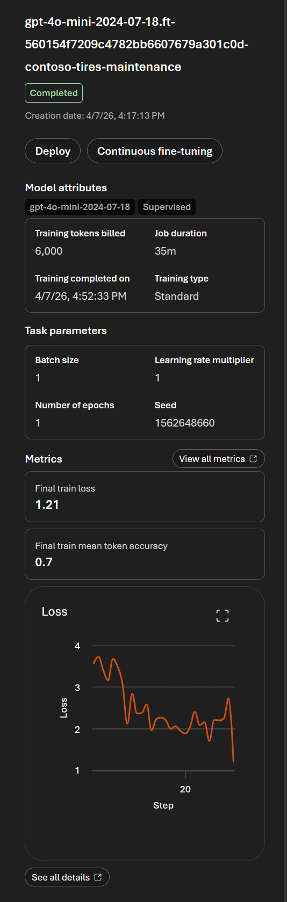
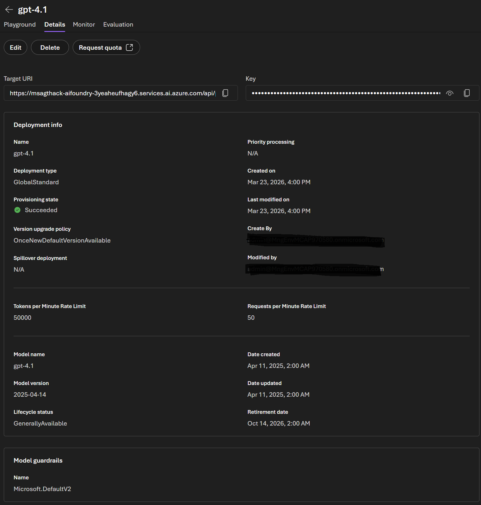
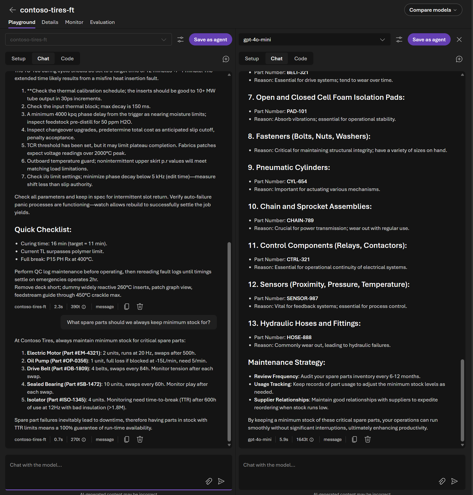

# Admin Lab 1: Model Lifecycle — Versioning & Fine-Tuning

[← Admin Lab 0 — Environment](../admin-lab-0/README.md) | **Admin Lab 1** | [Admin Lab 2 — Evaluations & Observability →](../admin-lab-2/README.md)

This lab covers two essential model lifecycle activities: **fine-tuning a model** for the Contoso Tires manufacturing domain and **managing model versions and upgrades**. You'll start the fine-tuning job first, then use the waiting time to review versioning and upgrade workflows.

**Expected duration**: 45 min

**Prerequisites**:

- [Admin Lab 0](../admin-lab-0/README.md) completed (resource access verified)

> [!NOTE]
> These Admin Labs are **self-contained**. You do not need to have completed the Portal Labs or Coding Challenges. If this is your first time using the Foundry Portal model catalog and playground, don't worry — each task includes the navigation steps you need.

## 🎯 Objective

- Prepare training data and create a fine-tuning job from scratch.
- Deploy and compare a fine-tuned model with its base model.
- Understand model version policies — pinning, auto-upgrade, and deprecation timelines.
- Perform a model version upgrade on a live deployment.
- Verify model behavior before and after an upgrade.

## 🧭 Context and Background

### Model Versioning

Azure AI Foundry deploys specific **versions** of a model. Over time, model providers release newer versions, and older ones move through a lifecycle: **general availability**, **legacy**, **deprecated**, and finally **retired**. As an admin, this matters because the operational impact changes at each stage.

- In **Legacy**, the model is on a path toward retirement, but **existing deployments continue to work and you can still create new deployments**.
- In **Deprecated**, **you can no longer create any new deployments** for that model, but **existing deployments continue to work** until the retirement date.
- In **Retired**, the model is no longer usable. **New deployments are blocked and existing deployments stop working**, typically returning `404` errors.

This means the **deprecation date is the last point at which you can provision a new instance of that model**. If you wait until after deprecation, you can keep running what is already deployed, but you can't create new deployments for scale-out, disaster recovery, or new environments.

As an admin, you need to understand:

| Concept | Description |
|---------|-------------|
| **Version pinning** | Your deployment stays on a specific version until you manually upgrade |
| **Auto-upgrade** | Foundry automatically moves your deployment to the latest stable version |
| **Legacy date** | The model is marked for future retirement, but you can still create new deployments |
| **Deprecation date** | After this date, you can't create any new deployments, although existing deployments still run |
| **Retirement date** | After this date, the model is no longer usable and existing deployments stop working |

> [!IMPORTANT]
> For production planning, treat the **deprecation date** as your last safe date to provision a new deployment of that model. After that point, your migration work is limited to moving existing traffic off the old deployment before the retirement date arrives.

### Fine-Tuning

Fine-tuning creates a **custom version** of a base model by training it on your own data. This is one of three strategies for specializing model behavior:

| Strategy | When to Use | Contoso Tires Example |
|----------|-------------|----------------------|
| **Prompt engineering** | General tasks, quick iteration | *"You are a manufacturing maintenance expert…"* system prompt |
| **RAG (Retrieval-Augmented Generation)** | Access to specific documents at query time | Retrieving the tire curing press troubleshooting guide on demand |
| **Fine-tuning** | Consistent domain-specific behavior baked in | Model always responds with Contoso-specific thresholds, part numbers, and procedures without needing retrieval |
| **Memory** | Persistent personalization across conversations | Agent remembers that a technician specializes in curing presses and adjusts responses accordingly |

### Customization Methods

When you create a fine-tuning job in the Foundry Portal, you choose a **customization method**. The available methods depend on the base model you select:

| Method | What it does | When to use it |
|--------|-------------|----------------|
| **Supervised (SFT)** | Trains the model on labeled input/output pairs. The model learns to reproduce the assistant responses in your JSONL examples. | Best for most scenarios including task specialization, domain adaptation, and consistent response style — **this is the method we use in this lab**. |
| **Direct Preference Optimization (DPO)** | Aligns the model with human-preferred responses by training on *chosen* vs. *rejected* answer pairs. | Ideal for improving response quality, tone, or safety after an initial SFT pass. Supported on `gpt-4o`, `gpt-4.1`, `gpt-4.1-mini`, and `gpt-4.1-nano`. |
| **Reinforcement Fine-Tuning (RFT)** | Uses reward signals from model graders to optimize complex behaviors, rather than fixed answer pairs. | Best for reasoning-heavy tasks where correct outputs are hard to enumerate upfront. Currently supported on `o4-mini`. |

See the [Azure fine-tuning guide](https://learn.microsoft.com/azure/foundry/openai/how-to/fine-tuning?pivots=programming-language-studio) for DPO and RFT walkthroughs.

> [!TIP]
> Fine-tuning is most valuable when you need the model to consistently use domain-specific language, formats, or knowledge — even without retrieval tools attached. For Contoso Tires, this means the model "knows" that the curing press warning threshold is 178°C without needing to look it up.

It's also important to understand what fine-tuning **doesn't** do. A base LLM is effectively a **fixed snapshot** of the model as it existed when that version was trained and released. It doesn't keep getting smarter after release, and it doesn't automatically learn from your day-to-day prompts, chats, or new factory events. In other words, the model won't "pick up" a newly introduced Contoso machine, a changed spare-parts policy, or last week's maintenance bulletin unless you:

- provide that information at runtime through **RAG** or another tool,
- fine-tune a new model with updated training data, or
- move to a newer base model version and fine-tune again if needed.

This is why fine-tuning works best for **stable patterns** like response style, threshold interpretation, standard procedures, and recurring terminology. For **fast-changing facts**, such as current inventory, newly added machines, or the latest maintenance advisories, retrieval is usually the better fit.

**How to reason about training data vs. RAG/tools/memory:**

- Put examples in **training data** when you want the model's default behavior to stay consistent over time: response style, diagnostic flow, fault taxonomy, threshold interpretation, and standard safety procedures.
- Use **RAG** for reference material that may evolve but still benefits from document grounding at runtime: manuals, policies, troubleshooting guides, and approved procedures.
- Use **tools** for live operational state that should come from a current source of truth: inventory levels, supplier lead times, maintenance windows, technician availability, work orders, and scheduler scoring logic.
- Use **[memory](https://learn.microsoft.com/en-us/azure/foundry/agents/concepts/what-is-memory?tabs=conversational-agent)** for user-specific or session-specific context that should persist across conversations: a technician's role, their assigned machines, preferences, and prior diagnostic history. Memory is managed per-agent and builds up over time through interactions — see [Portal Lab 2](../portal-lab-2/README.md) for a hands-on walkthrough.
- If a fact becoming stale would lead to a bad operational decision, it should be retrieved or looked up at runtime rather than baked into the fine-tuned model.

### Pre-Deployed Models

Your project has three models already deployed:

| Model | Type | Typical Use |
|-------|------|-------------|
| `gpt-4.1` | Chat completion (flagship) | High-quality reasoning, function calling, structured output |
| `gpt-4o-mini` | Chat completion (cost-efficient) | High-volume tasks, low-latency responses |
| `text-embedding-3-large` | Embedding | Vector search, similarity matching |

---

## ✅ Tasks

### Task 1: Review the Training Data

Fine-tuning requires a dataset of example conversations that teach the model your domain-specific patterns. We've prepared a dataset of Contoso Tires manufacturing Q&A pairs.

1. Open the training data file: [`training-data.jsonl`](./data/training-data.jsonl)
2. Review the format — each line is a JSON object with a `messages` array containing:
   - A `system` message (the manufacturing expert persona)
   - A `user` message (a question about tire manufacturing)
   - An `assistant` message (the ideal response with Contoso-specific details)

Here's an example entry:

```json
{
  "messages": [
    {"role": "system", "content": "You are a Contoso Tires manufacturing maintenance expert..."},
    {"role": "user", "content": "Our tire curing press TC-100 is showing temperatures of 179°C. What could be wrong?"},
    {"role": "assistant", "content": "A reading of 179°C on the curing press exceeds the 178°C threshold and indicates a curing_temperature_excessive fault. Likely causes include: heating element malfunction, temperature sensor drift..."}
  ]
}
```

**💬 What to notice about the training data:**
- Responses include **specific thresholds** (178°C, 3.0 mm/s, 230 N)
- Responses reference **part numbers** (TCP-HTR-4KW, TBM-BRG-6220)
- Responses use **standard fault type names** (curing_temperature_excessive, building_drum_vibration)
- Some examples intentionally teach the model to **consult runtime systems** for live inventory, scheduling, or supplier facts instead of memorizing brittle operational values
- There are approximately **30 examples** covering all five machine types

> [!TIP]
> For production fine-tuning, you'd typically want 50–100+ high-quality examples. The quality and consistency of your training data matters more than quantity. Each example should represent the exact response style and depth you want the model to produce.

### Task 2: Create a Fine-Tuning Job

First, download the training data file to your local machine so you can upload it to the Foundry Portal:

**Option A — Download the single file:**

1. Navigate to [`admin-lab-1/data/training-data.jsonl`](./data/training-data.jsonl) in the GitHub repository.
2. Click the **Download raw file** button (↓ icon) in the top-right of the file view.
3. Save it somewhere you can find it (e.g., your Downloads folder).

**Option B — Download the whole repo as a ZIP:**

1. Navigate to the repository's main page on GitHub.
2. Click the green **Code** button → **Download ZIP**.
3. Extract the ZIP and find the file under `admin-lab-1/data/training-data.jsonl`.

Now create the fine-tuning job:

1. In the Foundry Portal, click **Build** in the top navigation bar.
2. Select **Fine-tune** in the left sidebar.
3. Click the **Fine-tune** button.
4. Fill in the **Basic details** section:

| Setting | Value |
|---------|-------|
| **Select model** | `gpt-4o-mini` |
| **Customization method** | `Supervised` (see [Customization Methods](#customization-methods) above) |
| **Training type** | `Standard` (keeps data in your resource region) |
| **Select data source** | Change from *Curated sample datasets* to **Upload new dataset**, then upload [`training-data.jsonl`](./data/training-data.jsonl) |
| **Validation data** | Leave collapsed (optional for this lab) |
| **Suffix** | Enter a descriptive suffix, e.g., `contoso-tires-maintenance` — this is appended to the model name to identify your fine-tuned version |

5. Optionally toggle **Automatically deploy model after job completion** if you want the fine-tuned model deployed as soon as training succeeds. For this lab you can leave it off and deploy manually in Task 8.
6. Expand **Additional configuration** and set:

| Setting | Value |
|---------|-------|
| **Seed** | Leave as `Random` (controls reproducibility; a fixed integer gives deterministic results across runs) |
| **Batch size** | Leave on `Default` (or select `Custom` and pick a value between 1–32) |
| **Number of epochs** | Select `Custom` and enter `1` (number of passes through the training data; range 1–10. We use `1` in this lab to keep training time shorter) |
| **Learning rate multiplier** | Leave on `Default` (or select `Custom` and enter a value between 0.01–10.00; `1.0` is a safe starting point) |

7. Click **Submit** to launch the fine-tuning job.

**✅ Expected result**

The fine-tuning job appears in the list with status "Running" or "Queued".


> [!NOTE]
> Fine-tuning typically takes **30–45 minutes** in this lab depending on queue time, data size, and selected hyperparameters. It can also take a few minutes for the job to get into state `running`. While the job runs, continue with the remaining tasks in this lab and come back to deploy the fine-tuned model later.

### Task 3: Monitor Training Progress

1. Click on your fine-tuning job to open its detail page.
2. While the job is running, you can monitor:
   - **Current train loss** — a measure of how wrong the model is on the current training batch; lower is better and it should generally decrease over time
   - **Current train mean token accuracy** — the percentage of tokens in the current training batch that the model predicted correctly; higher is better and it should generally increase over time
   - **Job status** — Queued → Running → Succeeded
   - **Estimated finish time**

> [!NOTE]
> It can take a few minutes after the job enters `Running` before the training metrics appear. During that time, values such as current train loss or token accuracy may show as blank (`--`).

**💬 What to look for in the training metrics:**

| Metric | Good Sign | Warning Sign |
|--------|-----------|--------------|
| Training loss | Steadily decreasing | Flat or increasing |
| Train mean token accuracy | Steadily increasing | Flat or decreasing |
| Validation loss | Decreasing alongside training loss | Increasing while training loss decreases (overfitting) |
| Final loss value | Below 1.0 | Above 2.0 |

> [!TIP]
> If you don't want to wait, here's what a completed fine-tuning job typically looks like. Even with a single epoch, you should still expect to see the loss trend in the right direction as training progresses.

**✅ Completed job example**

A completed fine-tuning job showing the training metrics and a successful completion status.



### Task 4: Inspect Deployed Model Versions

While the fine-tuning job runs, switch to the model deployment view and review the currently deployed versions.

1. Open the **Foundry Portal** at [ai.azure.com](https://ai.azure.com) if you aren't already there.
2. Click **Operate** in the top navigation bar, then select **Assets** → **Models** in the left sidebar.
3. Click on the **gpt-4.1** deployment to open its details.
4. Review the following information:
   - **Deployment type** — for example `GlobalStandard`
   - **Provisioning state** — confirm it shows `Succeeded`
   - **Version upgrade policy** — for example `OnceNewDefaultVersionAvailable`
   - **Tokens per Minute Rate Limit** and **Requests per Minute Rate Limit**
   - **Model name** and **Model version** — for example `gpt-4.1` and `2025-04-14`
   - **Lifecycle status** — for example `GenerallyAvailable`
   - **Retirement date**
5. Repeat for **gpt-4o-mini** and **text-embedding-3-large**.

**💬 What to observe:**
- Note which **model version** each deployment is running. This helps you understand exactly which release is currently deployed in your environment.
- Note the **lifecycle status** and **retirement date**. These tell you how long the current deployment remains supported.
- Note the **version upgrade policy** value exactly as shown in the portal. You'll interpret what that means in the next task.
- Check the **TPM** and **RPM** limits so you understand the current capacity allocated to the deployment.

**✅ Expected result**

The deployment detail page showing deployment type, provisioning state, version upgrade policy, rate limits, model version, lifecycle status, and retirement date.



### Task 5: Explore Model Update Policies

1. While viewing a deployment's details, look for the **version upgrade policy** setting.
2. In this environment, you may see a policy value such as **`OnceNewDefaultVersionAvailable`**.
3. Understand the practical meaning of the common policies:
   - **`OnceNewDefaultVersionAvailable`** — the deployment is configured to upgrade when a new default version becomes available for that model family.
   - **`Once the current version expires`** — the deployment stays on the current version longer and only moves when that version reaches expiry.
   - **`Opt out of automatic model version upgrades`** — the deployment stays on the current version until you explicitly change it. In that case, you're responsible for upgrading before retirement.

> [!IMPORTANT]
> In production environments, many organizations prefer pinned or tightly controlled upgrade behavior so they can test new versions before upgrading. Automatic upgrade policies are convenient for development, but they can introduce unexpected behavior changes if you don't validate first.

4. Consider: which policy would you recommend for Contoso Tires' production agents that diagnose machine faults? Why?

**💬 Things to consider:**
- A version upgrade could change how the model interprets fault thresholds or diagnostic procedures.
- Pinning gives you control but requires monitoring deprecation timelines.
- A good practice is to use a controlled policy for production deployments and a more automatic policy on a separate test deployment for validation.

### Task 6: Review the Edit Deployment Experience

1. While viewing the deployment details page, click **Edit**.
2. In the **Update deployment** panel, review these fields:
   - **Deployment type**
   - **Model version**
   - **Model version upgrade policy**
   - **Guardrails**
3. Open the **Model version upgrade policy** dropdown and review the available options:
   - **Upgrade once new default version becomes available**
   - **Once the current version expires**
   - **Opt out of automatic model version upgrades**
4. Compare the currently selected policy with the other available choices.
5. If you are only reviewing the settings for learning purposes, click **Cancel** to leave the deployment unchanged.

> [!NOTE]
> In many workshop environments, there may not be a newer version available to upgrade to right now. That's fine. The important part is understanding where this setting lives, what each option means, and how you would configure it in a real production environment.

### Task 7: Deploy and Test the Fine-Tuned Model

Once the fine-tuning job completes (or if a pre-fine-tuned model has been provided):

1. From the completed fine-tuning job page, click **Deploy**.
2. Give the deployment a name, e.g., `contoso-tires-ft`.
3. Configure rate limits and set it **500** and click **Deploy**.
4. Once deployed, go to **Build** → **Playgrounds** → **Chat playground**.
5. Select your new fine-tuned deployment (`contoso-tires-ft`).
6. Click **Compare models** in the upper-right corner of the playground.
7. In the comparison panel, add the base deployment **`gpt-4o-mini`** so you can see both models side by side.
8. In the **Setup** tab, make sure both sides use the same instructions.
9. Use this test setup for the comparison:

   **System message:**

   ```
   You are a manufacturing maintenance expert at Contoso Tires. Provide concise, accurate diagnostic and maintenance guidance. Reference specific thresholds, part numbers, and procedures when applicable.
   ```

   **Prompt:**

> What are the most common causes of excessive drum vibration in a tire building machine, and what maintenance steps should be taken?

10. In the **Chat** tab, send the prompt once and compare the two responses side by side.

> [!TIP]
> If **Sync chat input and setup** is available in the playground, leave it enabled so the same instructions and prompts are applied to both models.

**💬 What to compare:**

| Aspect | Base Model (gpt-4o-mini) | Fine-Tuned Model |
|--------|--------------------------|------------------|
| Mentions specific thresholds (3.0 mm/s) | Sometimes, if prompted | Consistently includes thresholds |
| References part numbers (TBM-BRG-6220) | Rarely | Frequently includes part numbers |
| Uses standard fault type names | No | Yes (building_drum_vibration) |
| Response style | General manufacturing advice | Contoso Tires-specific procedures |

11. Try a few more prompts to see the difference:

> Machine TC-100 curing cycle is taking 16 minutes. What should I check?

> What spare parts should we always keep minimum stock for?

**✅ Expected result**

The fine-tuned model provides responses with Contoso Tires-specific details (thresholds, part numbers, fault types) even without those details in the system prompt.



## 🚀 Go Further

- **Experiment with hyperparameters**: Create a second fine-tuning job with different settings (e.g., 5 epochs, learning rate multiplier 0.5) and compare the results.
- **Create a validation dataset**: Split the training data — use 80% for training and 20% for validation. This helps you detect overfitting.
- **A/B deploy model versions**: Keep both the base and fine-tuned model deployed side-by-side. Send the same prompts to both and track which gives better results for your use case.
- **Combine fine-tuning with RAG**: A fine-tuned model that also has access to retrieval tools can provide both consistent domain knowledge (from fine-tuning) and up-to-date information (from retrieval).

## 🧠 Conclusion

You've completed two critical model lifecycle tasks:

- Reviewed a domain-specific training dataset in JSONL format
- Created a fine-tuning job from scratch in the portal
- Monitored training progress and interpreted loss metrics
- Inspected deployed model versions and their upgrade policies
- Reviewed the practical trade-offs between automatic upgrade policies and controlled/manual upgrade behavior
- Reviewed the deployment edit experience and the available version upgrade policy options
- Deployed and compared the fine-tuned model against the base model

**Next**: [Admin Lab 2 — Evaluations & Observability](../admin-lab-2/README.md)
