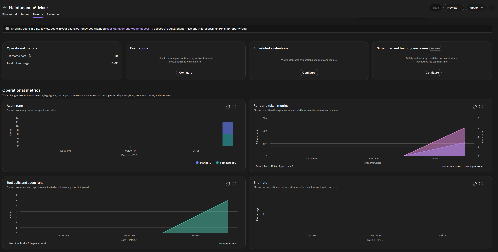
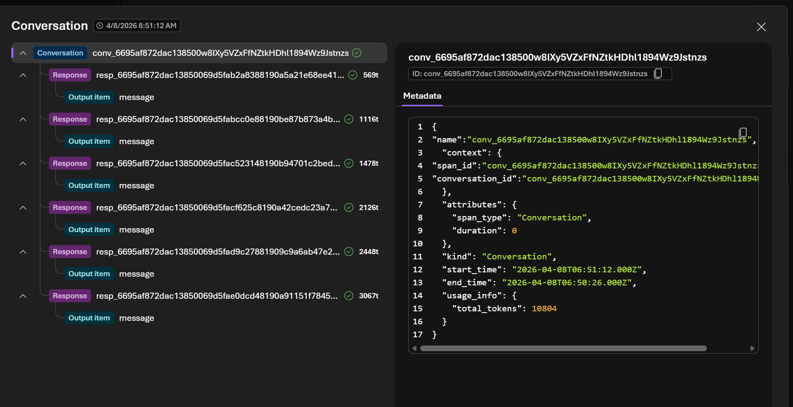
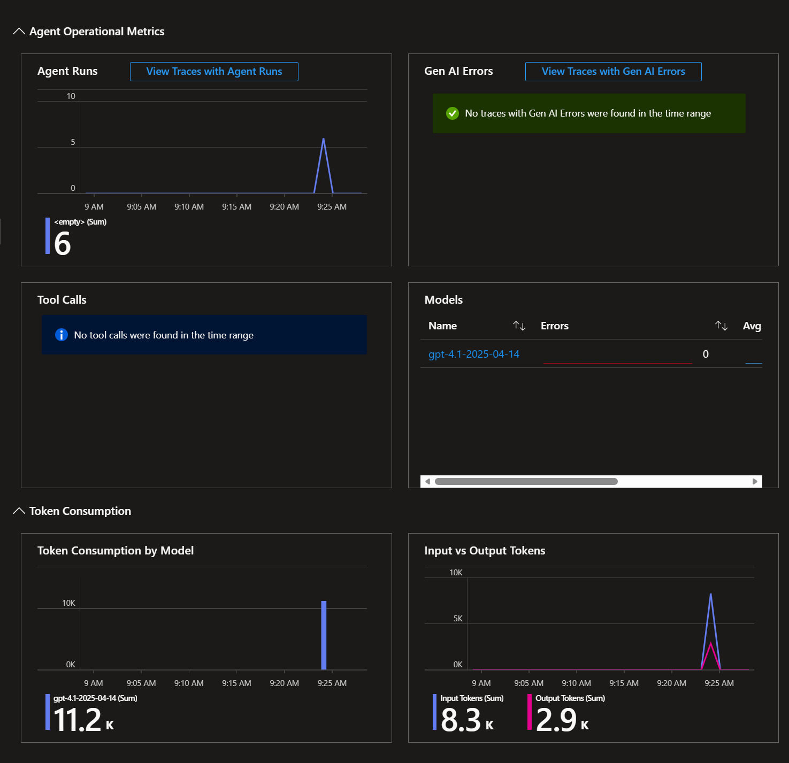
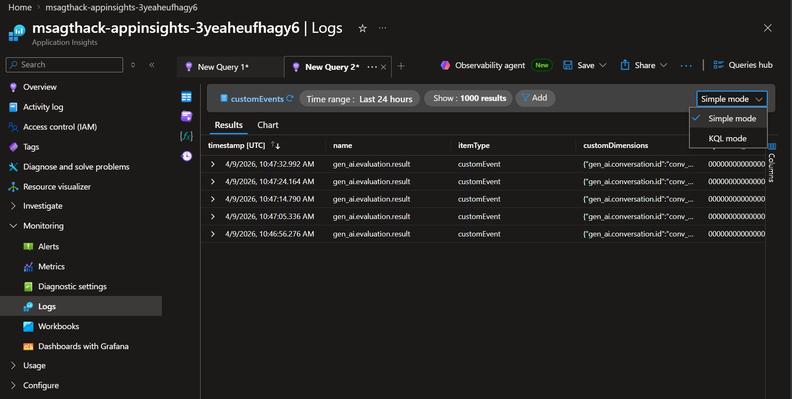
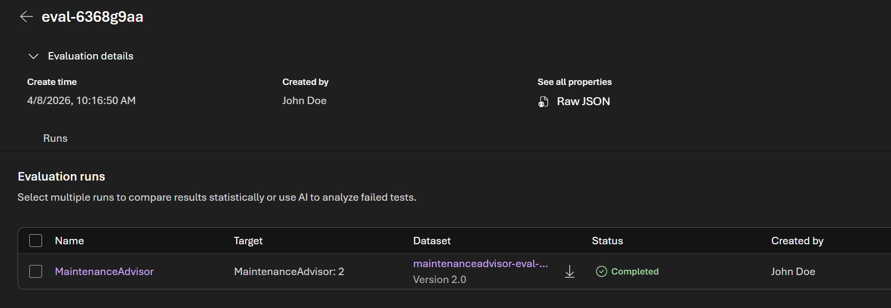
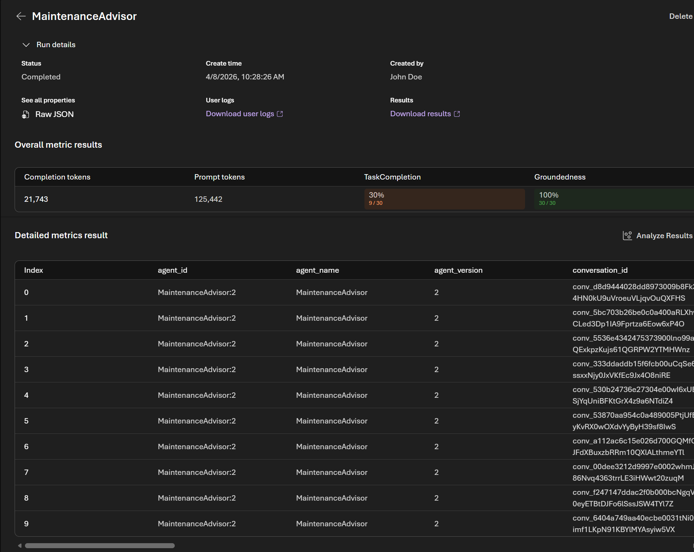

# Admin Lab 2: Evaluations & Observability

[← Admin Lab 1 — Model Lifecycle](../admin-lab-1/README.md) | **Admin Lab 2** | [Admin Lab 3 — Control Plane →](../admin-lab-3/README.md)

This lab focuses on **monitoring agent behavior** and **evaluating agent quality** — all through the Foundry Portal and Azure Monitor. You'll create a fresh agent, generate trace data, explore dashboards, and run an evaluation.

**Expected duration**: 35-40 min

**Prerequisites**:

- [Admin Lab 0](../admin-lab-0/README.md) completed (resource access verified)

> [!NOTE]
> This lab is self-contained. You do **not** need agents from the Portal Labs or Coding Challenges. You'll create a new agent from scratch in Task 1.

## 🎯 Objective

- Create a test agent and generate trace data through sample conversations.
- Explore the agent monitoring dashboard — token usage, run counts, errors.
- Drill into individual agent traces to understand execution details.
- Navigate from Foundry Portal into Application Insights for deeper analysis.
- Learn the basics of Kusto Query Language (KQL) and inspect telemetry tables.
- Set up and run an evaluation with built-in quality metrics.
- Interpret evaluation scores and identify areas for improvement.

## 🧭 Context and Background

### Why Observability Matters for Manufacturing Agents

In a tire manufacturing environment, agent errors can have real consequences:
- A **misdiagnosed fault** could lead to the wrong repair, wasting hours of technician time.
- An **incorrect risk score** could deprioritize a critical machine, leading to unplanned downtime.
- **Inconsistent responses** across shifts could confuse maintenance teams.

Observability gives you visibility into **what agents are doing, how well they're doing it, and where they need improvement**.

### The Observability Stack

Azure AI Foundry provides a layered observability architecture:

| Layer | What It Shows | Where to Find It |
|-------|--------------|-----------------|
| **Agent Monitoring Dashboard** | High-level metrics — token usage, run count, tool calls, errors | Foundry Portal → Agent → Monitor tab |
| **Agent Traces** | Individual execution details — message flow, latency, token counts per step | Foundry Portal → Agent → Traces |
| **Application Insights** | Full telemetry — dashboards, traces, KQL queries, custom dashboards | Azure Portal → Application Insights |
| **Evaluations** | Quality scores — groundedness, relevance, coherence, fluency | Foundry Portal → Evaluations |

> [!TIP]
> If you completed Challenge 3 (coding track), your agents already have trace data in Application Insights. The dashboards in this lab will show that data too. If not, don't worry — you'll generate fresh data in Task 1.

### What KQL Is and Why It Matters

**Kusto Query Language (KQL)** is the query language used across Azure Monitor, Log Analytics, and Application Insights. It lets you inspect raw telemetry, filter to the exact runs you care about, and summarize behavior over time.

For this lab, KQL is useful for questions such as:
- Which telemetry tables are receiving data from this agent?
- What operations ran in the last 1-2 hours?
- Are token usage and agent invocations showing up in `customEvents` or `dependencies`?

If you're new to KQL, think of it as a pipeline:
- Start with a table such as `customEvents` or `dependencies`
- Filter rows with `where`
- Pick useful columns with `project`
- Sort with `order by`
- Limit results with `take`

In this portal experience, it's often easiest to start in **Simple mode** to inspect which tables contain data, then switch to **KQL mode** to write a custom query.

### How to Think About Evaluations

Evaluations are how teams turn agent quality from a subjective impression into something they can measure over time.

In practice, teams use evaluations to:
- establish a **baseline** before making prompt, tool, or model changes
- compare one version of an agent against another
- define simple **acceptance thresholds** before release, such as a minimum task completion or groundedness score

It also helps to know that evaluators are not all the same:
- Some evaluators use an AI model as a judge to score output quality or agent behavior.
- Others use rules or more deterministic checks.

When you review results in Foundry, think at two levels:
- **Run-level results** summarize the whole evaluation, including pass/fail counts, evaluator summaries, and token usage.
- **Row-level results** show what happened for each individual prompt so you can inspect specific failures and understand why a score dropped.

For this workshop, the goal is not to build a full production evaluation pipeline. The goal is to learn the workflow: create a dataset, run a small evaluation, inspect the results, and use those results to guide the next improvement.

---

## ✅ Tasks

### Task 1: Create a Test Agent and Generate Trace Data

First, let's create a simple maintenance advisor agent and send it some test conversations.

1. In the Foundry Portal at [ai.azure.com](https://ai.azure.com), click **Build** in the top navigation bar.
2. Select **Agents** in the left sidebar, then click **Create agent**.
3. Configure the agent:

| Setting | Value |
|---------|-------|
| **Agent name** | `MaintenanceAdvisor` |
| **Model** | `gpt-4.1` |
| **Instructions** | *(copy the system prompt below)* |

```
You are a maintenance advisor for Contoso Tires, a tire manufacturing facility. You help maintenance technicians diagnose machine faults, recommend repair procedures, and identify required parts.

Key machines in the facility:
- Tire Curing Press (TC-100): Temperature threshold 178°C, cycle time threshold 14 min
- Tire Building Machine (TB-200, TB-300): Drum vibration threshold 3.0 mm/s, ply tension threshold 230 N
- Tire Extruder (C1): Throughput minimum 650 kg/h
- Tire Uniformity Machine (D1): Radial force variation threshold 100 N
- Banbury Mixer (E1): Mixing temperature threshold 160°C, vibration threshold 5.5 mm/s

Always reference specific thresholds, part numbers, and estimated repair times when applicable. Prioritize safety — recommend lock-out/tag-out procedures for any physical maintenance tasks.
```

4. Click **Save** to save the agent.

5. Now send **5–6 test conversations** to generate trace data. Use the agent's chat interface and send each of these prompts as separate conversations:

**Prompt 1 — Fault Diagnosis:**
> Machine TC-100 is showing a temperature of 179.2°C. Diagnose the issue and recommend next steps.

**Prompt 2 — Maintenance Procedure:**
> Walk me through the lock-out/tag-out procedure for the tire building machine TB-200 before bearing replacement.

**Prompt 3 — Parts Lookup:**
> What spare parts do I need for a heating element replacement on the curing press? Include part numbers.

**Prompt 4 — Risk Assessment:**
> The Banbury mixer E1 has vibration at 5.8 mm/s and temperature at 162°C. Both thresholds are breached. What's the priority?

**Prompt 5 — Scheduling:**
> Machine D1 has a risk score of 82. Should this be scheduled as routine maintenance or treated as urgent?

**Prompt 6 — Multi-machine Triage:**
> We have simultaneous warnings on TC-100 (temperature) and TB-300 (vibration). How should we prioritize?

> [!NOTE]
> It may take **2–5 minutes** for trace data to appear in the dashboards after you send your conversations. This is normal — telemetry is batched and processed asynchronously.

> [!IMPORTANT]
> Notice that this agent relies **entirely on its system prompt and the model's general training data** — it has no access to real documents, databases, or APIs. While the thresholds we hardcoded in the instructions will be used correctly, the model will **fabricate** details it doesn't actually know, such as specific part numbers, exact repair times, and detailed procedures. This is expected for this lab — the goal here is to generate trace data for observability, not to build an accurate agent.
>
> In [Portal Lab 3](../portal-lab-3/README.md) you'll see how attaching **tools** (file search, code interpreter) gives the agent access to real documents. In [Portal Lab 4](../portal-lab-4/README.md) you'll use **Foundry IQ** to ground the agent in structured knowledge. Those approaches produce significantly more reliable answers than instructions alone.

**✅ Expected result**

The agent responds to each prompt with manufacturing-specific guidance. Each conversation generates trace data.


### Task 2: Explore the Agent Monitoring Dashboard

1. In the Foundry Portal, navigate to your **Maintenance Advisor** agent.
2. Click the **Monitor** tab (or look for monitoring/analytics in the agent's detail page).
3. Review the dashboard cards and charts:

| Metric | What to Look For |
|--------|-----------------|
| **Estimated cost** | May show `$0` or remain limited depending on billing access; this is a cost summary card, not a usage validator |
| **Total token usage** | Total tokens consumed across your runs; should increase after your test prompts |
| **Agent runs** | The number of runs started and completed; should roughly match the conversations you sent |
| **Runs and token metrics** | A trend chart showing token growth over time alongside agent run count |
| **Tool calls and agent runs** | How often the agent ran and how many tools were invoked; for a basic agent with no tools, tool calls should stay at 0 |
| **Error rate** | Should remain at 0% for these test conversations |
| **Evaluations / Scheduled evaluations** | Configuration entry points for evaluation workflows rather than usage metrics |

4. Note the time range selector — you can filter to the last day, 7 days, etc.

**💬 What to observe:**
- **Total token usage** and the **Runs and token metrics** chart should move upward as you send more prompts.
- **Agent runs** should show both started and completed runs. If those diverge, investigate failed or stuck runs.
- **Tool calls and agent runs** is especially useful once you attach tools in later labs. For this basic agent, the chart should reflect runs but no tool activity.
- **Error rate** should stay flat at 0% for this exercise. In production, this is one of the fastest ways to detect regressions.

**✅ Expected result**

The monitoring dashboard showing operational metrics such as total token usage, agent runs, tool calls, and error rate for your test conversations.



### Task 3: Drill into Agent Traces

1. From the agent's detail page, look for **Traces**.
2. Select **Responses** tab and click one of your recent agent runs to view its trace details.
3. Examine the **trace tree** — the sequence of operations for that run:
   - **User message** — your input prompt
   - **LLM call** — the model invocation with the full prompt (system + user)
   - **Assistant response** — the generated output
4. For each step, review:
   - **Start time** and **End time** — how long did the LLM call take?
   - **Token count** — prompt tokens vs. completion tokens


**💬 What to observe:**
- The trace shows the full prompt sent to the model, including the system message. This is useful for debugging unexpected responses.
- Prompt tokens (system + user messages) are typically larger than completion tokens. Optimizing system prompts can reduce cost.
- If this agent had tools attached (file search, code interpreter, etc.), you'd see additional steps in the trace tree for each tool invocation.

**✅ Expected result**

An individual trace showing the message flow: user message → LLM call → assistant response, with latency and token counts.



### Task 4: Open in Application Insights

For deeper analysis, let's explore the raw telemetry in Azure Application Insights.

1. From the **Monitor** view in the Foundry Portal, select the **"Open in Azure Monitor"** link.
   - Alternatively, open the **Azure portal** at [portal.azure.com](https://portal.azure.com), navigate to your resource group, and click on the **Application Insights** resource directly.
2. Start with the **Application Insights dashboard** rather than going straight to Logs. Review the main panels:
   - **Agent Runs** — confirms whether recent runs are arriving in Application Insights.
   - **Gen AI Errors** — quickly shows whether the selected time range contains failed traces.
   - **Tool Calls** — should remain empty for this basic agent because no tools are attached.
   - **Models** — shows which deployed model handled the requests.
   - **Token Consumption by Model** and **Input vs Output Tokens** — useful for validating that your test prompts generated measurable usage.
3. Click **View Traces with Agent Runs** from the **Agent Runs** panel.
   - This opens the trace list filtered to agent-run telemetry.
   - Select one of the recent traces.
   - Review the trace summary: operation name, timestamp, duration, item count, and token usage.
   - Expand the trace details and inspect the dependency information tied to the agent invocation.
> [!TIP]
> In the current portal experience, the dashboard and trace drill-down are usually the fastest way to confirm ingestion. Use them first, then move to Logs and KQL.

> [!NOTE]
> **Troubleshooting: Foundry Monitor shows new runs, but Application Insights only shows old data**
>
> If you can see fresh data in the Foundry **Monitor** tab but your Application Insights queries only return old runs, try reconnecting the App Insights resource:
>
> 1. In the Foundry Portal, go to **Operate** → **Admin**.
> 2. Select your **Foundry project**.
> 3. Open **Connected resources**.
> 4. Find the resource with category **AppInsights** and select **Delete connection**.
> 5. Go back to your agent under **Build**.
> 6. Open the agent's **Monitor** tab.
> 7. Choose **Connect** and reconnect the correct **Application Insights** resource.
>
> After reconnecting, send a new test prompt to the agent and wait a few minutes before querying again.

**✅ Expected result**

Application Insights showing the dashboard panels and a filtered trace list from **View Traces with Agent Runs**.



### Task 5: Explore Logs and Write Your First KQL Queries

Now that you've confirmed telemetry is arriving, use **Logs** to inspect the raw tables behind the dashboard.

1. In Application Insights, click **Logs** in the left sidebar (under **Monitoring**).
2. If the **Queries hub** dialog opens, close it using the **X** in the upper-right corner.
3. If the editor opens in **Simple mode**, keep it there first so you can inspect the available tables. You can switch between **Simple mode** and **KQL mode** using the dropdown in the upper-right corner of the query editor.


4. In **Simple mode**, select a telemetry table and preview recent rows:
   - Start with **customEvents**.
   - Then inspect **dependencies**.
   - Notice that for these agent runs, useful telemetry may appear in **customEvents** and **dependencies**, even if **traces** is empty.
5. Once you've inspected the tables, switch the editor from **Simple mode** to **KQL mode**.
6. Run this query to see which common Application Insights tables currently contain recent data:

```kusto
union isfuzzy=true traces, requests, dependencies, customEvents, exceptions
| where timestamp > ago(2h)
| order by timestamp desc
| take 100
```

7. Review the results:
   - **itemType** tells you which table each row came from.
   - **customDimensions** often contains AI-specific metadata.
   - **customMeasurements** may contain token usage values.
8. Now generate a chart to see how telemetry is distributed across tables:

```kusto
union isfuzzy=true customEvents, dependencies
| where timestamp > ago(2h)
| summarize telemetryCount = count() by itemType
| render barchart
```

9. Review the chart:
   - Each bar represents a telemetry table — **customEvent** or **dependency**.
   - The bar height shows how many telemetry items arrived from each table.
   - This tells you at a glance where the agent is writing telemetry. For example, you might see more rows in **dependencies** (one per LLM call) than in **customEvents**.
10. Use the query results and chart to confirm:
   - recent agent activity is arriving in the workspace
   - telemetry is landing in the expected tables
   - the row counts are consistent with the number of test prompts you sent


**✅ Expected result**

The **Logs** experience opens successfully, you dismiss the **Queries hub**, switch from **Simple mode** to **KQL mode**, inspect recent telemetry rows, and generate a bar chart showing telemetry counts per table type.

### Task 6: Set Up an Evaluation

Evaluations measure the **quality** of agent responses using built-in metrics. Let's evaluate our maintenance advisor.

1. In the Foundry Portal, navigate to **Build** in the top navigation bar.
2. Select **Evaluations** in the left sidebar.
3. Click **Create**.
4. The evaluation setup opens as a **wizard** with four sections: **Target**, **Data**, **Criteria**, and **Review**.
5. In **Target**:
   - Select **Agent**.
   - Choose your **MaintenanceAdvisor** agent.
   - If multiple versions are listed, pick the current version you want to evaluate.
   - Click **Next**.
6. In **Data**:
   - Select **Synthetic generation**.
   - Click **Generate** to open the **Generate synthetic dataset** dialog.
   - In the dialog:
     - Set **Name of the new dataset** to `maintenanceadvisor-eval-dataset`.
     - Select **gpt-4o-mini** as the **Model**.
       - Set **Number of rows** to **30**.
     - In **Prompt**, enter: `Generate maintenance troubleshooting, repair planning, safety, parts, and triage questions for the Contoso Tires factory scenario.`
     - Leave **Seed data** empty for this lab.
   - Click **Confirm** to create the synthetic dataset.
   - After the dataset is generated, return to the wizard and continue.
   - Click **Next**.
 

7. In **Criteria**:
   - The wizard may auto-suggest a larger set of evaluators across **Agents**, **Quality**, and **Safety**.
   - For this lab, keep the evaluation intentionally small so the run finishes faster and the results are easy to interpret.
   - Remove the auto-suggested evaluators you do not need so that only these two evaluators remain:
      - **TaskCompletion**
      - **Groundedness**
   - This gives you one metric for whether the agent completed the job and one metric for whether the response stayed grounded in the provided context.
   - Remove the tool-specific evaluators, since this agent does not use tools in this lab.
   - Remove all **Safety** evaluators for this run so the results stay focused and easier to interpret.
   - In a real-world evaluation pipeline, teams usually keep a broader evaluator set such as **TaskAdherence**, **IntentResolution**, **Relevance**, **Coherence**, **Fluency**, and appropriate **Safety** checks. That gives better coverage, but it also increases evaluation time and makes the first pass harder to interpret.
   - Click **Next**.
8. In **Review**:
   - Set the **Evaluation name** to `maintenance-advisor-baseline`.
   - Confirm the selected agent, version, data source, and criteria.
   - Click **Submit**.

> [!NOTE]
> Even with only **TaskCompletion** and **Groundedness** selected, evaluation runs can still take around **10 minutes** depending on region, capacity, and service load. This lab intentionally uses **30 rows** so you have enough results to reason about patterns instead of drawing conclusions from only a few samples.

**✅ Expected result**

The evaluation wizard completes successfully, and the new run appears in the list with status "In progress" and eventually "Completed".



### Task 7: Analyze Evaluation Results

1. Once the evaluation completes, click on the run to view results.
2. Review the **overall scores** for each metric:

| Metric | What It Measures | Good Score |
|--------|-----------------|------------|
| **TaskCompletion** | Did the agent actually complete the requested task? | Higher pass rate is better |
| **Groundedness** | Are responses based on provided context (not hallucinated)? | Higher pass rate is better |

3. Drill into **individual prompt results** — click on each test prompt to see its score breakdown.
4. Identify the **lowest-scoring prompt** — what went wrong? Common issues:
   - Low task completion → Agent gave partial advice or failed to answer the actual maintenance question
   - Low groundedness → Agent may have hallucinated part numbers or thresholds

**💬 What to observe:**
- The run summary may show aggregate evaluator results as percentages across all rows. For example, a **TaskCompletion** result around **30%** means the agent only fully completed a minority of the generated tasks.
- Without tools like file search or code interpreter, the agent relies entirely on its training data. Responses about specific part numbers may score lower on groundedness because the model is generating them from memory rather than retrieving them.
- A low task completion score with a strong groundedness score often means the agent stayed factual but did not fully solve the user's problem.
- This is a useful failure mode for the lab because it gives you something concrete to reason about: are the instructions too vague, is the agent overly cautious, does it need tool access, or does it need a better prompt for prioritization and actionability?
- This is exactly the kind of insight that helps you decide: does this agent need RAG tools? Better instructions? Fine-tuning?

**✅ Expected result**

Evaluation results showing per-metric scores and per-prompt breakdowns.



> [!IMPORTANT]
> Evaluation scores are not absolute quality measures — they're relative indicators. Use them to **compare** across iterations: change the system prompt, add a tool, or fine-tune the model, then re-evaluate to see if scores improve.

## 🚀 Go Further

- **Improve TaskCompletion**: Copy the agent and revise the instructions so responses are more action-oriented. For example, require the agent to always provide a clear diagnosis, a recommended next action, and a short justification. Re-run the same evaluation and compare the **TaskCompletion** percentage before and after. After that, test other improvement techniques such as adding tools from [Portal Lab 3](../portal-lab-3/README.md), grounding the agent with Foundry IQ from [Portal Lab 4](../portal-lab-4/README.md), tightening the system prompt, or switching to a fine-tuned model.
- **Compare system prompts**: Copy the agent, modify the instructions (e.g., make them shorter or more detailed), and run the same evaluation. Compare scores to see which prompt performs better.
- **Set up Azure Monitor alerts**: In Application Insights, create an alert rule that triggers when agent error rate exceeds 5% or average latency exceeds 10 seconds.
- **Evaluate the fine-tuned model**: If your fine-tuning job from [Admin Lab 1](../admin-lab-1/README.md) has completed, create a new agent using the fine-tuned model and run the same evaluation. Compare scores with the base model agent.
- **Custom KQL dashboards**: Build a custom workbook in Application Insights to visualize agent token usage by time of day, error patterns, or latency percentiles.

## 🧠 Conclusion

You've built a complete observability workflow:

- Created a test agent and generated trace data through realistic conversations
- Explored the built-in monitoring dashboard for high-level metrics
- Drilled into individual traces to understand execution details
- Navigated from Foundry Portal to Application Insights for deep analysis
- Used KQL to inspect the raw telemetry tables behind the dashboards
- Ran an evaluation with built-in quality metrics
- Interpreted scores and identified improvement opportunities

**Next**: [Admin Lab 3 — Control Plane](../admin-lab-3/README.md)
