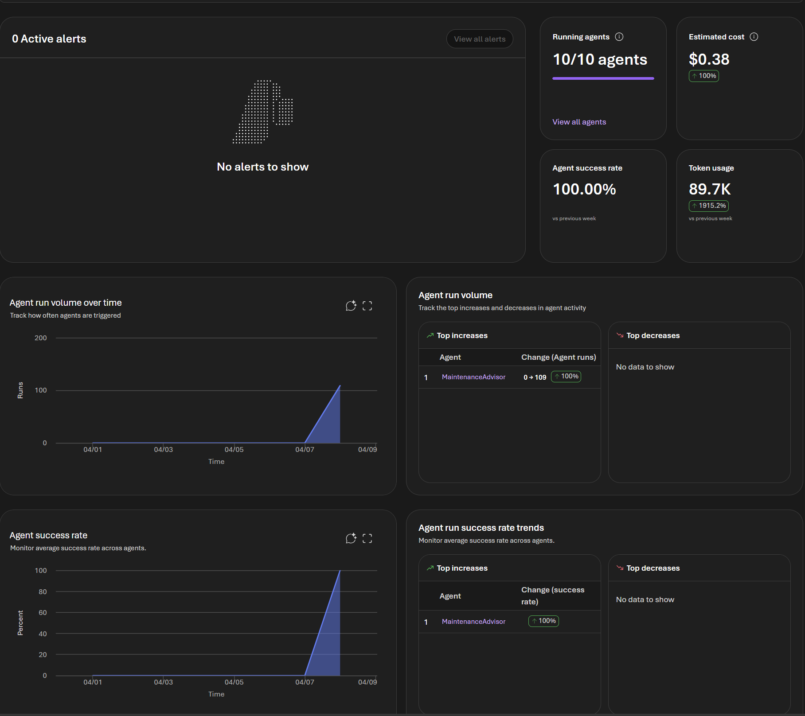
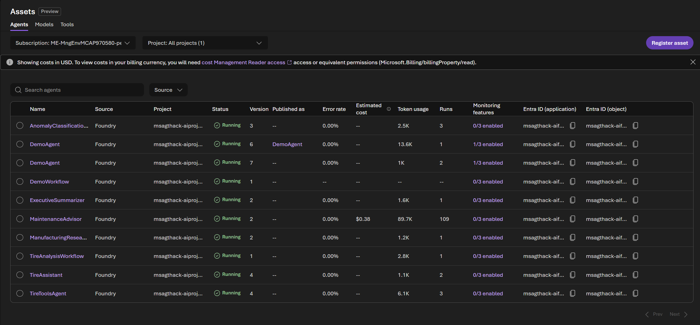
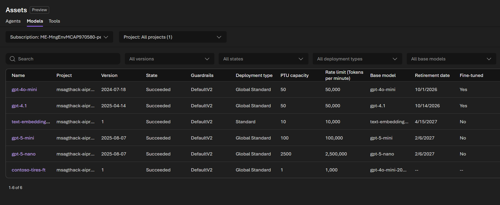
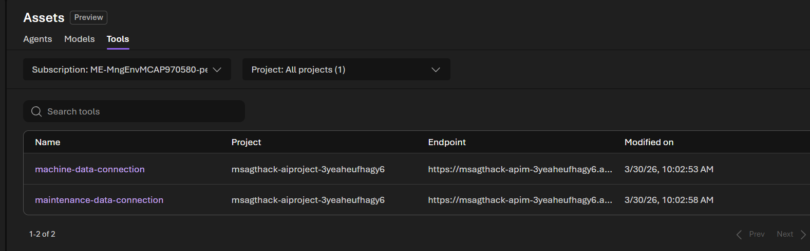
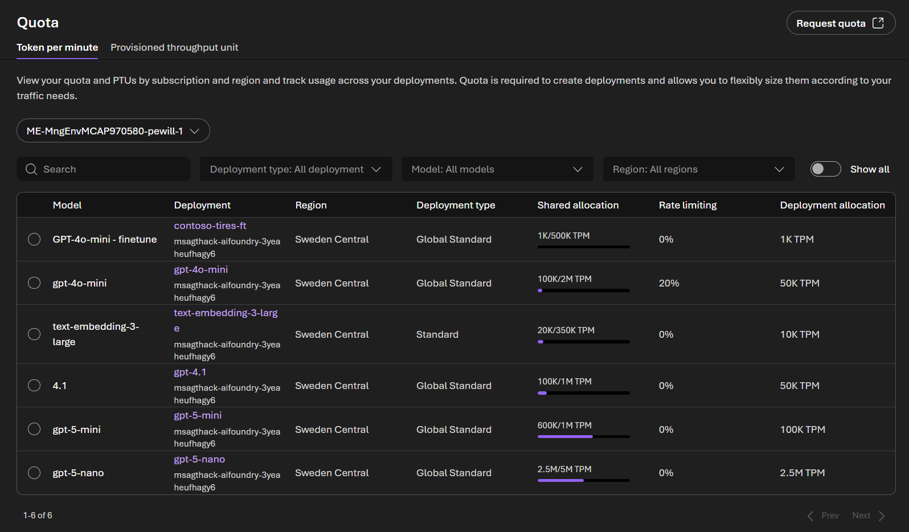
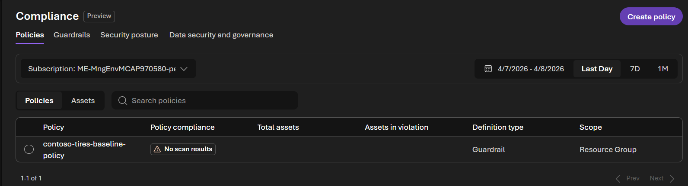
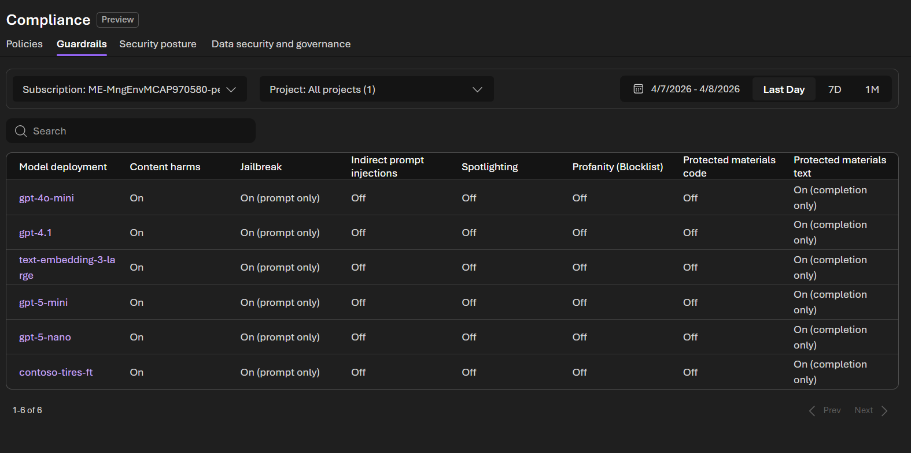
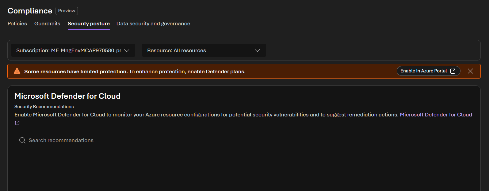
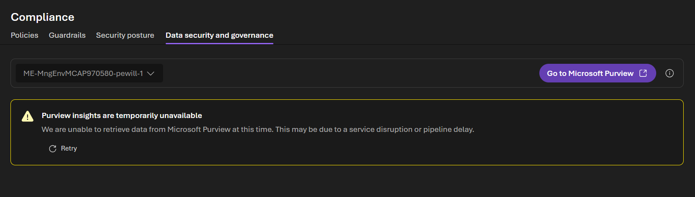

# Admin Lab 3: Control Plane

[← Admin Lab 2 — Evaluations & Observability](../admin-lab-2/README.md) | **Admin Lab 3** | [Admin Lab 4 — Identity, Security & Publishing →](../admin-lab-4/README.md)

This lab explores **Microsoft Foundry Control Plane** through the **Operate** experience in Azure AI Foundry. You'll learn how administrators manage resources, agents, quotas, observability, and governance across projects from a unified control plane.

**Expected duration**: 30 min

**Prerequisites**:

- [Admin Lab 0](../admin-lab-0/README.md) completed (resource access verified)
- Helpful (but not required): [Admin Lab 2](../admin-lab-2/README.md), which created an agent with monitoring data

## 🎯 Objective

- Navigate the Foundry Control Plane and understand the organizational hierarchy (hubs → projects → resources).
- Explore fleet-level monitoring and cross-project dashboards.
- Manage agent lifecycle from the control plane — view agents, versions, and status.
- Review quotas, rate limits, capacity planning, and governance surfaces.

## 🧭 Context and Background

### From Per-Agent to Fleet-Level

In [Admin Lab 2](../admin-lab-2/README.md), you explored monitoring for a **single agent** — token usage, traces, and evaluations. That's the right view for a developer or a specific maintenance team.

But as a **product owner or platform administrator**, you need a broader view:
- How many agents are running across all projects?
- Which projects consume the most tokens?
- Are we approaching our quota limits?
- Which agents need attention (errors, version deprecation)?

This is where **Microsoft Foundry Control Plane** comes in.

Foundry Control Plane is the unified management layer for agents, models, tools, observability, quota, compliance, and security across your Foundry estate. It is designed for the point where an organization moves beyond one-off agents and starts operating a fleet across multiple projects and teams.

### The Organizational Hierarchy

Azure AI Foundry organizes resources in a hub-and-spoke model:

```
Azure Subscription
└── Resource Group
    └── AI Foundry Hub
        ├── Project A (Contoso Tires Maintenance)
        │   ├── Model deployments (gpt-4.1, gpt-4o-mini, ...)
        │   ├── Agents (Maintenance Advisor, ...)
        │   └── Connections (Storage, AI Search, ...)
        ├── Project B (could be another team/use case)
        └── Shared resources (compute, storage, quotas)
```

| Level | Who Manages It | What They See |
|-------|---------------|---------------|
| **Subscription** | IT / Cloud admin | Cost, compliance, policies |
| **Hub** | Platform admin / Product owner | Shared resources, quotas, cross-project metrics |
| **Project** | Developer / Team lead | Models, agents, tools, evaluations |

> [!NOTE]
> In this workshop you likely have one hub with one project. In production environments, a hub typically serves multiple projects for different teams or use cases. Foundry Control Plane is designed for that multi-project reality.

### The Operate Experience and Its Panes

The official overview describes Foundry Control Plane as a role-aware experience surfaced through **Operate** in the Foundry portal. Rather than being a single page, it is a set of panes that each support a different operational job:

| Pane | What It Helps You Do |
|------|----------------------|
| **Overview** | See fleet health, cost trends, run completion, alerts, and compliance posture at a glance |
| **Assets** | Inspect agents, models, and tools across projects; filter by metadata, health, usage, and recommendations |
| **Compliance** | Manage guardrail policies, compare guardrail configurations, review security posture (Defender for Cloud), and configure data governance (Microsoft Purview) |
| **Quota** | Review deployment quota usage, request capacity, and plan scaling |
| **Admin** | Manage projects, users, connected resources, and cross-project configuration |

This matters for the lab because the old mental model of "go to one management page" is too narrow. The control plane is really the full **Operate** surface, with **Admin** as only one part of it.

### What the Control Plane Adds Beyond Project Views

Without Foundry Control Plane, you manage most things through individual project views and separate Azure blades. The control plane adds:

- **Fleet inventory** across agents, models, and tools
- **Cross-project observability** so you can correlate monitoring, evaluations, and operational signals
- **Quota and cost visibility** across the environment
- **Compliance and guardrail management** at broader scope
- **Security integration** with services such as Microsoft Defender, Microsoft Purview, and Microsoft Entra

Some advanced governance capabilities in the official overview depend on an **AI gateway** being configured. You do not need to set that up for this workshop, but it is useful context for why the production control-plane story includes more than inventory and dashboards.

### How the Foundry Control Plane Relates to Agent 365

It helps to separate two different control-plane layers:

- **Microsoft Foundry Control Plane** is the platform control plane for your Foundry hub and projects. It focuses on Azure-side administration such as projects, model deployments, agents, resources, monitoring, quota, compliance, and governance.

**Microsoft Agent 365 (A365)** is Microsoft's broader IT admin control plane for agents across the organization. Its purpose is to help IT and security teams govern agents at tenant scope, not just within one Foundry environment.

At a high level:

- **Microsoft Foundry Control Plane** focuses on Azure-side administration of your Foundry estate: projects, model deployments, agents, resources, monitoring, quota, compliance, and governance.
- **Microsoft Agent 365 (A365)** focuses on organization-wide agent governance: registry, access control, visualization, interoperability with Microsoft 365, and security.

In other words, the Foundry control plane answers questions like:
- Which projects and agents exist in this Foundry environment?
- What quotas, resources, and monitoring data do we have?
- Which model deployments and connections back these agents?

Agent 365 answers a different set of questions:
- Which agents exist across the tenant, regardless of where they were built?
- Which agents should be approved, governed, and exposed to Microsoft 365 users and workflows?
- How do we apply organization-wide identity, access, and security controls to those agents?

Today, these experiences are related but not identical. The long-term direction described by Microsoft is that published Foundry agents and agents registered in the Foundry control plane will appear in the Agent 365 registry automatically, but that integration is still in progress.

There is already one concrete bridge between them: **Foundry hosted agents** can be published as **digital workers** into Agent 365. That path currently requires a code-based publishing flow rather than a portal-only experience.

For this lab, stay focused on **Microsoft Foundry Control Plane** as the Azure-side control plane exposed through **Operate**. Then think of **Agent 365** as the next organizational layer above it for tenant-wide governance and Microsoft 365 integration.

**Useful references:**
- [Control Plane overview](https://learn.microsoft.com/en-us/azure/foundry/control-plane/overview)
- [Monitoring across the fleet](https://learn.microsoft.com/en-us/azure/foundry/control-plane/monitoring-across-fleet)
- [Managing agents](https://learn.microsoft.com/en-us/azure/foundry/control-plane/how-to-manage-agents)
- [Publish an agent as a digital worker in Agent 365](https://learn.microsoft.com/en-us/azure/foundry/agents/how-to/agent-365)

---

## ✅ Tasks

### Task 1: Navigate the Operate Experience

1. Open the **Foundry Portal** at [ai.azure.com](https://ai.azure.com).
2. Click **Operate** in the top navigation bar.
3. You will land on the **Overview** pane. Note the left sidebar which contains the five control-plane panes: **Overview**, **Assets**, **Compliance**, **Quota**, and **Admin**.
4. Explore the **Overview** pane:
   - **Running agents** — how many agents are active across your projects?
   - **Estimated cost** — cost trends for the selected time range
   - **Agent success rate** — overall success rate across agents
   - **Token usage** — aggregate token consumption
   - **Agent run volume** — trends in agent activity (top increases and decreases)
   - Use the **Subscription** and **Project** filters at the top to scope the view

**💬 What to observe:**
- The Operate experience gives you a **top-down view** — instead of navigating into each project individually, you see everything at once.
- In a production environment with multiple projects (e.g., maintenance agents, quality agents, scheduling agents), this is where you'd get a consolidated view.

**✅ Expected result**

The Operate Overview pane showing running agents, cost, success rate, and token usage.



### Task 2: Explore Assets — Agents, Models and Tools

The **Assets** pane is the fleet-level inventory for everything running across your projects. It has three tabs: **Agents**, **Models**, and **Tools**.

1. In the **Operate** experience, click **Assets** in the left sidebar.

#### 2a. Agents tab

The **Agents** tab (the default view) lists every agent across your projects. For each agent you can see:

| Column | Description |
|--------|-------------|
| **Name** | The agent's display name (clickable to drill into details) |
| **Source** | Where the agent was created (e.g., Foundry) |
| **Project** | Which project the agent belongs to |
| **Status** | Running, Stopped, or Failed |
| **Version** | The agent's version number (increments with changes) |
| **Published as** | Whether the agent has been published (e.g., as a digital worker) |
| **Error rate** | Percentage of failed runs |
| **Estimated cost** | Cost attributed to this agent |
| **Token usage** | Total tokens consumed |
| **Runs** | Number of times the agent has been invoked |

Use the **Search** bar and **Source** filter to narrow the list. Note how this gives you a consolidated view of all agents — in production with dozens of agents, this is how you'd identify which agents consume the most tokens, have the highest error rates, or haven't been used recently.

**💬 What to observe:**
- Managing agents from the Assets pane lets you perform fleet-level operations — for example, identifying all agents that use a model version that's about to be deprecated.
- Version tracking helps you understand which agents have been updated recently and which may be running outdated configurations.
- The **Runs** and **Token usage** columns are useful for **cost allocation** — you can see which agents drive the most consumption.

> [!IMPORTANT]
> In production, **do not delete agents without checking** if they're actively serving users. Use the run count and token usage to determine if an agent is still in use.

#### 2b. Models tab

Click the **Models** tab. This shows all model deployments across your projects:

| Column | Description |
|--------|-------------|
| **Name** | The deployment name (e.g., gpt-4.1, gpt-4o-mini) |
| **Project** | Which project owns the deployment |
| **Version** | Model version |
| **State** | Deployment state (Succeeded, Failed, etc.) |
| **Guardrails** | Content filter configuration applied |
| **Deployment type** | Global Standard, Standard, etc. |
| **PTU capacity** | Provisioned Throughput Units allocated |
| **Rate limit (TPM)** | Tokens per minute limit for the deployment |
| **Base model** | The underlying model |
| **Retirement date** | When the model version will be retired |

**💬 What to notice:**
- The **Retirement date** column is critical for planning — you can see at a glance which deployments need to be upgraded before a model version is retired.
- **Rate limit (TPM)** shows the quota allocated to each deployment. Compare this across deployments to understand capacity distribution.
- Use the filters (versions, states, deployment types, base models, content filters) to quickly find specific deployments.

#### 2c. Tools tab

Click the **Tools** tab. This shows tool connections available across your projects:

| Column | Description |
|--------|-------------|
| **Name** | The tool/connection name |
| **Project** | Which project the tool belongs to |
| **Endpoint** | The API endpoint the tool connects to |
| **Modified on** | When the tool was last updated |

This gives you visibility into which data connections and integrations back your agents.

**✅ Expected result**

The Assets pane showing the Agents, Models, and Tools tabs with fleet-level inventory.





### Task 3: Review Quotas and Capacity

1. In the **Operate** experience, click **Quota** in the left sidebar.
2. The Quota pane has two tabs: **Token per minute** and **Provisioned throughput unit**. Start on the **Token per minute** tab.
3. Use the filters (Subscription, Deployment type, Model, Region) to scope the view. Review the columns for each deployment:

| Column | Description |
|--------|-------------|
| **Model** | The base model (e.g., gpt-4o-mini, 4.1, text-embedding-3-large) |
| **Deployment** | The deployment name and the project it belongs to |
| **Region** | The Azure region hosting the deployment (e.g., Sweden Central) |
| **Deployment type** | Global Standard or Standard |
| **Shared allocation** | How much of the subscription-level quota is allocated vs. available (e.g., 100K/1M TPM) |
| **Rate limiting** | Current rate-limiting percentage — 0% means no throttling is occurring |
| **Deployment allocation** | The TPM quota assigned to this specific deployment |

4. Compare the **Shared allocation** bars across deployments — the bar shows the proportion of total subscription quota consumed by each deployment.
5. Note the **Request quota** button in the top right — this is how you request more capacity when approaching limits.
6. Consider these questions:
   - If you deployed three agents all using gpt-4.1, how would the TPM quota be shared among them?
   - What happens when you hit the rate limit? (Answer: requests get throttled with HTTP 429 responses)
   - If your token usage is trending upward, how would you request more capacity?

**💬 What to think about:**
- Quotas are **shared across all agents** using the same model deployment. If agent A uses 80% of the TPM quota, agents B and C only have 20% to share.
- The **Shared allocation** column shows both the deployment's allocation and the subscription-wide limit — this helps you understand how much headroom remains for new deployments.
- For production, consider deploying the same model multiple times with separate quotas for different teams or priority levels — critical maintenance diagnostic agents could get a higher-quota deployment than general Q&A agents.
- **Rate limit planning** is essential before scaling to production. A single test agent uses minimal quota, but 50 concurrent maintenance technicians querying the system will need significantly more.

**✅ Expected result**

The Quota pane showing TPM allocations per model deployment.



### Task 4: Explore Compliance and Governance

The **Compliance** pane is where platform administrators define and monitor guardrails, policies, security posture, and data governance across all model deployments. It has four tabs: **Policies**, **Guardrails**, **Security posture**, and **Data security and governance**.

1. In the **Operate** experience, click **Compliance** in the left sidebar.

#### 4a. Policies tab — define and enforce guardrail policies

The **Policies** tab lets you create guardrail policies that mandate minimum safety controls for model deployments across a subscription or resource group. A guardrail policy sets compliance *requirements*; the guardrails themselves are the technical controls that enforce those requirements.

> [!NOTE]
> Setting a policy does not automatically enforce guardrails — it defines the compliance bar. Deployments are then evaluated against the policy, and non-compliant ones are flagged.

1. On the **Policies** tab, you'll likely see an empty list — no guardrail policies exist by default. Note the **Policies** and **Assets** sub-tabs — once policies are created, **Policies** shows compliance by policy, while **Assets** shows compliance by model deployment.
2. Click **Create policy** to open the policy creation wizard. Follow these steps to create a content safety policy:

   **Step 1 — Specify minimum controls:**
   - In the **Risk** dropdown under **Content safety**, select **Jailbreak**.
   - For **Intervention point**, check **User input**.
   - For **Action**, select **Annotate and block**.
   - Click **Add control** to add it to the policy.
   - Repeat for a second control: select **Hate** as the risk, set the **Severity level** slider to **Low**, check both **User input** and **Output**, set the action to **Annotate and block**, and click **Add control**.
   - Click **Next**.

   **Step 2 — Select scope:**
   - Select **Resource Group** and select your resource group from the list.
   - Click **Select**, then click **Next**.

   **Step 3 — Select exceptions (optional):**
   - You can skip this step for the workshop — no exceptions needed.
   - Click **Next**.

   **Step 4 — Review:**
   - Enter a policy name, e.g. `contoso-tires-baseline-policy`.
   - Review the scope, controls, and exceptions.
   - Click **Submit** to create the policy.

3. After submitting, return to the **Policies** tab. Your new policy will appear in the list. Note that it takes up to 30 minutes for Azure Policy to complete its compliance scan, so initial compliance results may not appear immediately.

> [!NOTE]
> Creating policies requires the **Owner** or **Resource Policy Contributor** role at subscription or resource group level. If you get a permissions error, ask your workshop administrator for help.

**💬 What to observe:**
- Guardrail policies use **Azure Policy** under the hood — creating a policy here creates a corresponding Azure Policy assignment.
- The **Risk** dropdown is organized into categories: **Content safety** (Jailbreak, Hate, Sexual, Self-harm, Violence, Profanity), **Indirect prompt injections** (Indirect prompt injections, Spotlighting), and **Protected materials** (Protected material for code, Protected material for text).
- In production, you might have a strict policy for production deployments (requiring all content filters on) and a more relaxed policy for development resource groups.

#### 4b. Guardrails tab — compare guardrail configurations

The **Guardrails** tab shows a fleet-wide view of guardrail configurations across all model deployments. Each row is a model deployment, and each column is a guardrail control.

2. Click the **Guardrails** tab. Review the columns:

| Column | Description |
|--------|-------------|
| **Model deployment** | The deployment name (e.g., gpt-4o-mini, gpt-4.1) |
| **Content harms** | Whether content harm filtering is On or Off |
| **Jailbreak** | Prompt shield status (e.g., On (prompt only)) |
| **Indirect prompt injections** | Whether indirect injection detection is enabled |
| **Spotlighting** | Whether spotlighting defense is enabled |
| **Profanity (Blocklist)** | Whether profanity blocklist filtering is active |
| **Protected materials code** | Whether code protection is enabled |
| **Protected materials text** | Whether text protection is enabled (e.g., On (completion only)) |


**💬 What to observe:**
- This view lets you **compare guardrail settings side-by-side** across all deployments without opening each one individually.
- In the workshop environment, you'll likely see a default configuration. In production, this is where you'd spot a deployment missing content filtering before it reaches users.
- If you find a gap, you can navigate to **Build > Guardrails** in the relevant project to update settings, or create a guardrail policy to enforce requirements at scale.

#### 4c. Security posture tab — Defender for Cloud integration

The **Security posture** tab surfaces security recommendations from **Microsoft Defender for Cloud**. It assesses your Azure resources against security standards and highlights misconfigurations or vulnerabilities.

4. Click the **Security posture** tab.
5. If Defender for Cloud is connected, you will see security recommendations with affected resources and risk levels. If not, you'll see a prompt to **Enable Microsoft Defender for Cloud in Azure Portal**.

**💬 What to understand:**
- Defender for Cloud provides **security posture management** (identifying misconfigurations) and **threat protection** (detecting jailbreak and prompt injection attacks at runtime).
- Threat protection alerts for jailbreak attacks are based on risk detection in Foundry for user-input attacks and can be correlated with Microsoft Purview audit records.
- Enabling Defender requires the **Security Admin** or **Owner** role on the subscription.

> [!TIP]
> You don't need to enable Defender for this workshop. Just understand that this is the integration point — in production, Defender recommendations would appear here alongside remediation links.

#### 4d. Data security and governance tab — Microsoft Purview integration

The **Data security and governance** tab connects to **Microsoft Purview** for enterprise-grade data security and compliance over AI-generated content (prompts and responses).

6. Click the **Data security and governance** tab.
7. You'll see a link to **Go to Microsoft Purview** and the current integration status. In the workshop environment, Purview may not be connected.

**💬 What to understand:**
- When enabled, Microsoft Purview can process prompt and response data from Foundry apps and agents. This supports audit logging, sensitive information type (SIT) classification, data security posture management (DSPM) for AI, insider risk management, and eDiscovery.
- Enabling Purview integration requires the **Azure AI Account Owner** role.
- This is the most advanced governance surface — relevant for organizations with strict regulatory requirements around AI-generated data.

**✅ Expected result**

The Compliance pane showing guardrail policies, guardrail configurations, security posture, and data governance.






## 🚀 Go Further

- **Set up quota alerts**: In Azure Monitor, create an alert that triggers when token usage exceeds 80% of the allocated TPM for any deployment.
- **Create a guardrail policy**: If you have the required permissions (Owner or Resource Policy Contributor), try creating a guardrail policy that requires content harm filtering and jailbreak detection on all deployments in your subscription.
- **Enable Defender for Cloud**: Connect Microsoft Defender for Cloud to your subscription and review the security recommendations that appear on the Security posture tab.
- **Cost estimation**: Using the token usage data from the Overview dashboard, estimate the monthly cost for running your maintenance advisor agent at production scale (e.g., 100 queries per hour, 8 hours per day).
- **Multi-project scenario**: Discuss with your team how you'd organize a production environment — separate projects for maintenance, quality, and scheduling agents? Or one project with multiple agents?

## 🧠 Conclusion

You've explored the **Operate** experience — the admin's single pane of glass:

- Navigated the Operate experience and its Overview dashboard
- Explored fleet-level assets — agents, models, and tools across projects
- Reviewed quotas and capacity planning for model deployments
- Explored compliance — guardrail policies, guardrail configurations, security posture, and data governance

**Next**: [Admin Lab 4 — Identity, Security & Publishing](../admin-lab-4/README.md)
