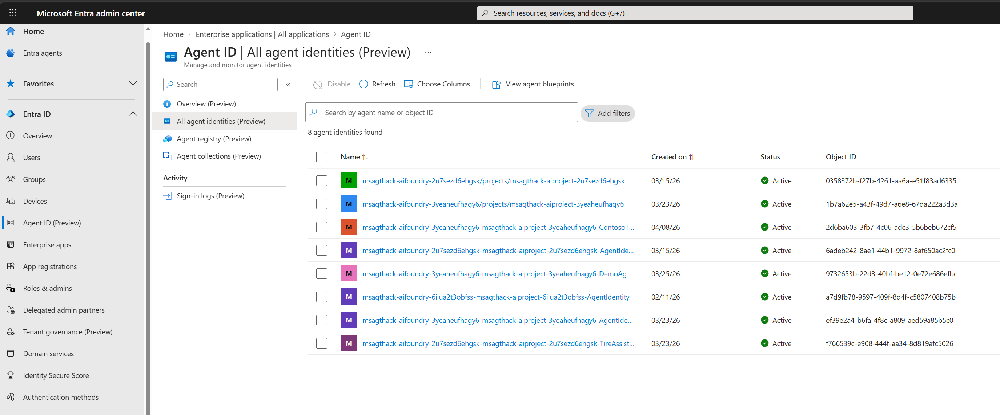
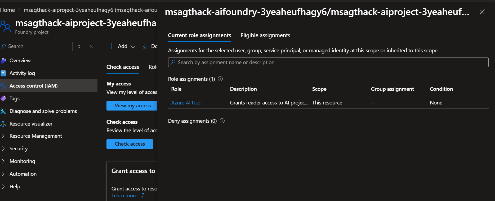
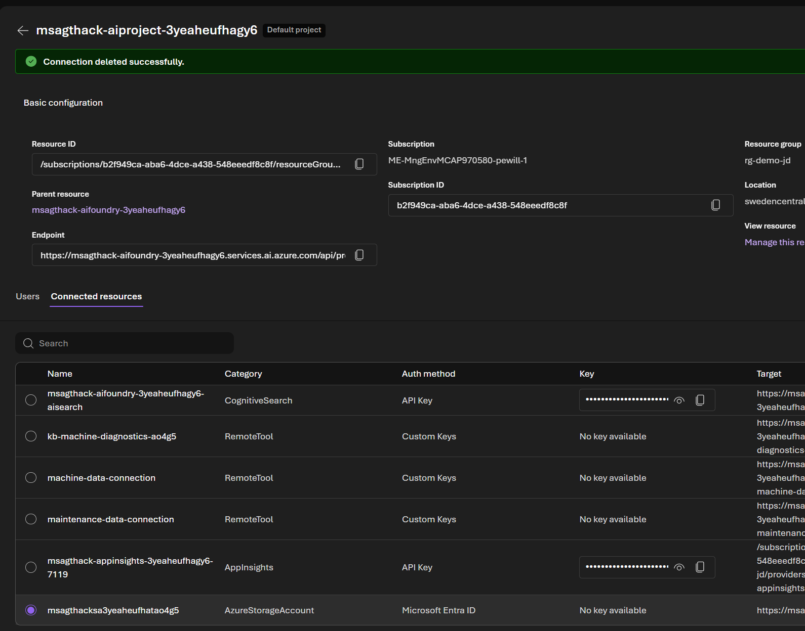
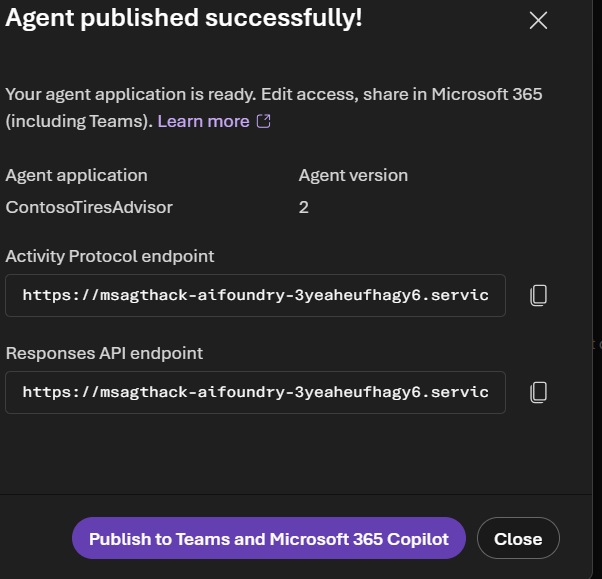
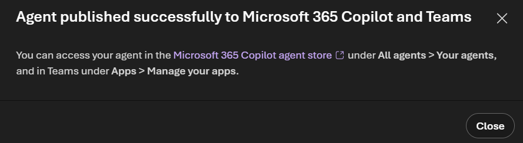
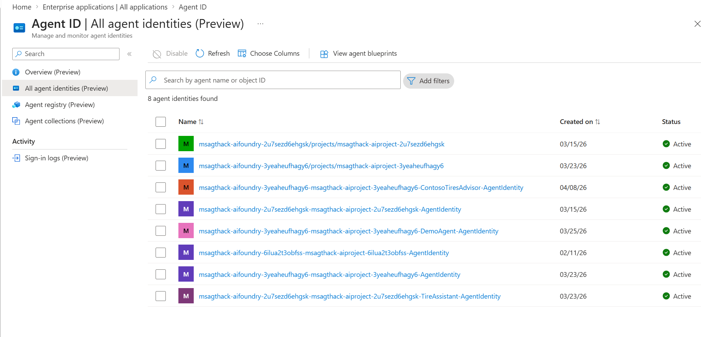

# Admin Lab 4: Identity, Security & Publishing

[← Admin Lab 3 — Control Plane](../admin-lab-3/README.md) | **Admin Lab 4** | ← Final Lab

This capstone lab ties together identity, security, and publishing. You'll trace the identity journey of an agent — from the **shared project identity** it uses during development, through **tool access security**, to the **dedicated identity** it receives after publishing to production. Along the way, you'll inspect service principals in **Entra ID** to see exactly how Foundry connects to Azure resources.

**Expected duration**: 40 min

**Prerequisites**:

- [Admin Lab 0](../admin-lab-0/README.md) completed (resource access verified)
- Helpful (but not required): [Admin Lab 2](../admin-lab-2/README.md), which created an agent you can publish

## 🎯 Objective

- Understand the agent identity model — project managed identity vs. published agent identity.
- Find and inspect the Foundry project's service principal in Entra ID.
- Review IAM role assignments that connect Foundry to dependent Azure resources.
- Understand how to secure tool and connection access for agents.
- Publish an agent and observe the identity change in Entra ID.
- Test a published agent endpoint and manage published versions.

## 🧭 Context and Background

### The Agent Identity Journey

An agent's identity determines **what resources it can access** and **under whose authority it acts**. This changes as the agent moves from development to production:

```
Development (Unpublished)                Production (Published)
┌──────────────────────────┐             ┌──────────────────────────┐
│  Agent A                 │             │  Agent A (published)     │
│  Agent B                 │ ─Publish──► │                          │
│  Agent C                 │             │  Dedicated identity      │
│                          │             │  (new service principal  │
│  Shared project          │             │   in Entra)              │
│  managed identity        │             └──────────────────────────┘
│  (one SP for all)        │
└──────────────────────────┘
```

| Phase | Identity Used | Who Controls Access |
|-------|--------------|-------------------|
| **Development** | Project's **managed identity** (system-assigned) — shared by all agents in the project | Platform admin configures IAM roles on the project |
| **Published** | A **dedicated service principal** created for this specific agent | Admin configures permissions for the published agent independently |
| **On-Behalf-Of (OBO)** | Agent acts under the **end user's identity** — using delegated permissions | Requires custom Entra app registration and consent flow |

> [!NOTE]
> "SP" = Service Principal — the identity object in Microsoft Entra ID (formerly Azure Active Directory) that represents an application or service.

### Why This Matters

- **During development**, all agents in the project share the same identity. If one agent can access Cosmos DB, they all can. This is convenient but not suitable for production isolation.
- **After publishing**, the agent gets its own identity. You can grant it only the specific permissions it needs — following the **principle of least privilege**.
- **OBO (On-Behalf-Of)** is important when the agent needs to access resources **as the end user** — for example, if different users should see different data based on their own permissions.

**Useful references:**
- [Authentication and Authorization in Foundry](https://learn.microsoft.com/en-us/azure/foundry/concepts/authentication-authorization-foundry)
- [Agent Identity](https://learn.microsoft.com/en-us/azure/foundry/agents/concepts/agent-identity)
- [Publish an Agent](https://learn.microsoft.com/en-us/azure/foundry/agents/how-to/publish-agent)
- [What is Microsoft Entra Agent ID?](https://learn.microsoft.com/en-us/entra/agent-id/what-is-microsoft-entra-agent-id)
- [Authorization with Agent ID](https://learn.microsoft.com/en-us/entra/agent-id/authorization-agent-id)
- [Agent On-Behalf-Of OAuth Flow](https://learn.microsoft.com/en-us/entra/agent-id/identity-platform/agent-on-behalf-of-oauth-flow)

---

## ✅ Tasks

### Task 1: Find the Foundry Project Identity in Entra ID

Every AI Foundry project has a **system-assigned managed identity** — this is the service principal that agents use to authenticate when calling tools and accessing resources during development.

1. Open the **Microsoft Entra admin center** at [entra.microsoft.com](https://entra.microsoft.com) in your browser.
2. In the left sidebar, click **Agent ID (Preview)** (under **Entra ID**).
3. Click **All agent identities (Preview)** in the left sidebar.
4. In the search bar, type the prefix of your AI Foundry project name (e.g., `msagthack`).
   - You should see entries with names like `msagthack-aifoundry-.../projects/msagthack-aiproject-...` — these are the **project-level managed identities** shared by all agents in each project.
   - You may also see published agent identities (e.g., names ending in `-AgentIdentity`) — we'll explore those in Task 5.
5. Click on the identity that matches your AI Foundry project to open its details. Review:

| Field | What It Shows |
|-------|-------------|
| **Name** | The project identity path (e.g., `msagthack-aifoundry-.../projects/msagthack-aiproject-...`) |
| **Object ID** | The directory object ID (used in IAM role assignments) |
| **Status** | Should be **Active** |
| **Created on** | When the project was provisioned |

6. In the left sidebar of the identity, explore **Owners and sponsors (Preview)** and **Agent identity's access (Preview)** to understand who manages this identity and what permissions it has.

> [!TIP]
> The **Agent ID blade** is the easiest way to find Foundry agent identities. It shows both project-level and published agent identities in one place — no need to search through Enterprise apps or remove filters. You can also find the project's managed identity in the **Azure portal** by navigating to your **AI Foundry resource** → **Identity** (left sidebar) → **System assigned** tab.

**💬 What to observe:**
- This single project identity is used by **all agents** in the project during development. When Agent A calls a tool that accesses Cosmos DB, it authenticates as this identity.
- The Object ID you see here corresponds to the principal entries in IAM role assignments — you'll verify this in Task 2.
- Notice that you can already see the distinction between **project identities** (shared) and **published agent identities** (dedicated) — this is the identity journey we'll explore throughout the lab.

**✅ Expected result**

The Agent ID blade showing your project's managed identity alongside any published agent identities.



> [!TIP]
> If you prefer the classic approach, you can also find the managed identity via **Enterprise apps**: expand **Entra ID** → **Enterprise apps**, remove the **Application type** filter, and search for your project name. But the Agent ID blade is purpose-built for agent identities and much more convenient.

### Task 2: Review IAM Role Assignments

The managed identity needs specific roles on each connected resource to function. Let's trace the permission chain and see where roles exist — and where they're missing.

1. In the **Azure portal** at [portal.azure.com](https://portal.azure.com), navigate to your **Storage Account** in the resource group (starts with `msagthacksa`).
2. Click **Access control (IAM)** in the left sidebar.
3. Click the **Role assignments** tab.
4. Scan the list for any assignments to the Foundry project's managed identity (the one you found in Task 1).

**💬 What to observe:**
- You should see **no role assignments** for the Foundry project's managed identity on this storage account. The managed identity has not been granted access here yet.
- Without roles like **Storage Blob Data Contributor** or **Storage Blob Data Reader**, an agent trying to read or write blob data through this identity would receive a **403 Forbidden** error.
- This is the expected state — resources start with no permissions until explicitly granted. This is the **principle of least privilege** in action.

5. Now navigate to your **AI Search** resource (starts with `msagthack-search-`) and repeat:
   - Click **Access control (IAM)** → **Role assignments** tab.
   - Here you **will** see the managed identity with roles like **Search Index Data Reader** and **Search Service Contributor** — these were assigned when the AI Search connection was created during provisioning.

| Resource | Managed Identity Roles | Why |
|----------|----------------------|-----|
| **AI Search** | Search Index Data Reader, Search Service Contributor | Assigned when the search connection was provisioned |
| **Storage Account** | *(none)* | No connection using managed identity exists yet |

> [!TIP]
> You can also use **Check access** (on the Check access tab) to search for the managed identity specifically. Select **Managed identity** → **All system-assigned managed identities** → select your Foundry project identity to see its roles on any given resource.

**✅ Expected result**

The IAM blade on the Storage Account showing no role assignments for the Foundry managed identity — confirming that permissions are missing before a managed-identity connection is created.



### Task 3: Create a Connection and Understand RBAC Requirements

Now let's create a new connection to the Storage Account using **Microsoft Entra ID** authentication — and observe the RBAC warning that Foundry displays.

#### Step 1: Review Existing Connections

1. In the **Foundry Portal** at [ai.azure.com](https://ai.azure.com), click **Operate** in the top navigation bar.
2. Click **Admin** in the left sidebar.
3. Select your project (e.g., `msagthack-aiproject-...`).
4. Click the **Connected resources** tab.
5. Review the existing connections (your list may differ depending on previous labs):

| Name | Category | Auth method | What It Accesses |
|------|----------|-------------|-----------------|
| `msagthack-aifoundry-...-aisearch` | CognitiveSearch | API Key | AI Search index for RAG queries |
| `kb-machine-diagnostics-...` | RemoteTool | Custom Keys | Knowledge base diagnostics via MCP |
| `machine-data-connection` | RemoteTool | Custom Keys | Machine data via API Management MCP endpoint |
| `maintenance-data-connection` | RemoteTool | Custom Keys | Maintenance data via API Management MCP endpoint |
| `msagthack-appinsights-...` | AppInsights | API Key | Application Insights for telemetry |

6. Note the authentication methods — **API Key** and **Custom Keys**. None of these use identity-based authentication yet.

#### Step 2: Create a Storage Account Connection

1. Click the **Add connection** button.
2. In the **Choose a connection** dialog, scroll to the **Data** section and select **Storage Account**.
3. In the **Create a new connection** dialog:
   - **Storage Account**: Select your storage account (e.g., `msagthacksa3yeaheufhagy6`).
   - **Auth Type**: Select **Microsoft Entra ID**.
4. Notice the warning banner:

   > ⚠️ *Changing the authentication method to Entra ID will require advanced role-based authentication settings for individual users to access this connection. Contact your admin for help or learn more about RBAC settings.*

5. Click **Connect** to create the connection.

**💬 What to observe:**
- The warning is telling you that **creating the connection alone is not enough**. Unlike API key connections where the key provides immediate access, Entra ID connections rely on RBAC role assignments that must be configured separately.
- Foundry does **not** automatically add the required IAM roles on the storage account for your project's managed identity. An admin must grant the appropriate roles (e.g., **Storage Blob Data Contributor**) on the target resource.
- This is by design — it enforces **separation of concerns**: the person creating the connection (a developer) may not have permission to modify IAM roles (an admin task).
- This means the connection exists in Foundry, but it would **fail at runtime** if an agent tried to use it to access blob data — because the underlying RBAC permissions are missing. Creating a connection defines *what* to connect to; IAM roles define *whether* the identity is allowed to.

5. Consider the **Auth method** implications across all your connections:

| Auth Method | Secrets to Manage | Who Controls Access | Best For |
|------------|-------------------|-------------------|----------|
| **API Key** | Yes — key rotation needed | Key holder | Quick setup, dev/test |
| **Microsoft Entra ID** | No — uses identity | IAM admin via RBAC roles | Production workloads |
| **Project Managed Identity** | No — uses project identity | IAM admin via RBAC roles | Project-scoped resources |
| **Custom Keys** | Varies | Service-specific | Third-party integrations |

**✅ Expected result**

The new storage account connection appears in the Connected resources list with **Microsoft Entra ID** as the auth method, and the warning banner is displayed during creation.



> [!IMPORTANT]
> In production, **Microsoft Entra ID** (identity-based) authentication is recommended over API keys. It eliminates secret management, enables fine-grained RBAC, and provides audit trails through Entra sign-in logs. However, it requires that an admin explicitly assigns the correct roles — the connection alone is not sufficient.

### Task 4: Create and Publish an Agent

Let's create a simple agent, publish it, and observe what happens to its identity.

#### Step 1: Create the Agent

1. In the **Foundry Portal**, navigate to **Build** → **Agents** → **Create agent**.
2. Configure the agent:

| Setting | Value |
|---------|-------|
| **Agent name** | `ContosoTiresAdvisor` |
| **Model** | `gpt-4.1` |
| **Instructions** | `You are a maintenance advisor for Contoso Tires. Help technicians diagnose faults and plan repairs. Reference specific thresholds and part numbers.` |

3. Save the agent.

#### Step 2: Publish the Agent

1. In the top-right corner, click the **Publish** dropdown and select **Publish agent**.
2. A dialog titled **"Make your agent production-ready"** will appear, showing:
   - **Publish target version** (e.g., `v2`)
   - **Last saved** timestamp
3. Click **Publish**.
4. On the **"Agent published successfully!"** dialog, note the two endpoints:
   - **Activity Protocol endpoint** — for bot-style interactions
   - **Responses API endpoint** — for REST API calls
5. Click **Close** (we'll explore the Teams publishing next).

> [!NOTE]
> Publishing does more than just expose an endpoint — it creates an **Agent Application** Azure resource that wraps your agent version with:
> - A **stable endpoint URL** that stays the same even as you roll out new agent versions
> - A **dedicated Entra agent identity**, separate from the project's shared identity
> - Its own **RBAC scope**, so you can control access independently
> - **Azure Policy integration**, since the Agent Application is a full ARM resource
>
> The development version of the agent continues to exist in the project for iteration.

> [!IMPORTANT]
> **Permissions for callers**: API key authentication is **not supported** for invoking published Agent Applications. Callers must authenticate with Microsoft Entra ID and have the **Azure AI User** role (or a custom role with the `/applications/invoke/action` permission) assigned on the **Agent Application resource** in Entra. Without this role, callers will receive authorization errors when trying to invoke the published agent.
>
> **Permissions for tools**: Because the identity changes at publish time, RBAC permissions **don't transfer automatically**. You must reassign roles to the new agent identity for any resources the agent accesses (e.g., Cosmos DB, Storage). If you skip this step, tool calls that worked during development will fail with authorization errors.

**✅ Expected result**

The success dialog showing the agent application name, version, and both endpoint URLs.



#### Step 3: Publish to Teams and Microsoft 365 Copilot (Optional)

You can also publish your agent to **Microsoft 365 Copilot and Teams**, making it available as a conversational app.

1. Click the **Publish** dropdown again and select **Publish to Teams and Microsoft 365 Copilot**.
2. In the **"Teams and Microsoft 365 Copilot"** dialog, review section **① Prepare your agent for publishing**:
   - **Principal ID of the agent identity** — this is the dedicated service principal created when you published (you'll inspect this in Task 5)
   - **Tenant ID** — your Entra tenant
   - **Azure Bot Services** — if none exist, click **Create a Bot Service** to create one. Once created, select it from the dropdown.
3. Expand **Edit agent details** and fill in the required fields:

| Field | Value |
|-------|-------|
| **Name** | `ContosoTiresAdvisor` |
| **Version** | `1.0.0` |
| **Short description** | `Maintenance advisor for Contoso Tires factory equipment` |
| **Full description** | `Helps technicians diagnose faults and plan repairs for factory equipment` |
| **Developer name** | Your name or `Contoso Tires` |
| **Website** | Any valid URL (e.g., `https://contoso.com`) |
| **Terms of use URL** | Any valid URL |
| **Privacy statement URL** | Any valid URL |

4. Click **Prepare agent** to validate the configuration.
5. In section **② Publish your agent to Microsoft 365 Copilot and Microsoft Teams**, select **Individual scope** (best for personal testing — no admin approval required).
6. Click **Submit**.

> [!TIP]
> If you or your colleagues have a **Microsoft 365 Copilot license**, the agent will appear in the Microsoft 365 Copilot agent store under **All agents → Your agents**, and in Teams under **Apps → Manage your apps**.

**✅ Expected result**

A success message: *"Agent published successfully to Microsoft 365 Copilot and Teams"*.



### Task 5: Review the Published Agent Identity in Entra Agent ID

Return to the **Agent ID blade** you used in Task 1. Now that you've published an agent, there should be a **new dedicated identity** for it.

1. Go to [entra.microsoft.com](https://entra.microsoft.com).
2. Navigate to **Agent ID (Preview)** → **All agent identities (Preview)** (the same blade you used in Task 1).
3. Refresh the list. You should now see a **new entry** alongside the project-level identities you saw earlier:
   - **Published agent identity** — name like `...-ContosoTiresAdvisor-AgentIdentity` (the dedicated identity created when you published in Task 4)
6. Click on your **ContosoTiresAdvisor** agent identity to inspect it:
   - **Status**: Active
   - **Object ID**: This matches the Principal ID from the **Publish → View details** dialog
   - **Owners**: The user who published the agent
   - **Blueprint ID**: Links to the agent blueprint (the agent definition)
   - **Created on**: The date you published
7. In the left sidebar, click **Owners and sponsors (Preview)** to see who has management rights over this agent identity.
8. Click **Agent identity's access (Preview)** to view any permissions and Entra roles granted to this identity.

**💬 What to observe:**
- Compare the list now to what you saw in Task 1 — the **new published agent identity** is the key difference. Publishing created a dedicated identity separate from the shared project identity.
- Each published agent gets its own identity entry, separate from the project-level identity. This is the identity isolation that enables per-agent least-privilege access.
- The **Owners** field shows who is responsible for this agent — important for governance and accountability.
- **Agent identity's access** shows 0 permissions and 0 Entra roles initially — an admin would need to grant specific roles for the published agent to access resources independently.

**💬 This is the identity journey:**
1. During development → agent uses the **project's managed identity** (shared by all agents)
2. After publishing → agent receives a **dedicated agent identity** (isolated, visible in Agent ID blade)
3. Optionally → configure **Agent On-Behalf-Of (OBO)** so the agent acts under the **end user's identity** ([learn more](https://learn.microsoft.com/en-us/entra/agent-id/identity-platform/agent-on-behalf-of-oauth-flow))

**✅ Expected result**

The Agent ID blade showing all agent identities, with your published ContosoTiresAdvisor identity visible.



### Task 6: Manage Published Versions

1. Back in the **Foundry Portal**, navigate to your published agent.
2. Select **Publish** then **View details**.
3. Review the version information:
   - **Version number** — increments with each publish
   - **Published date** — when this version was deployed
   - **Status** — Active, Previous, or Rolled back
4. If you make a change to the agent (e.g., update the instructions) and publish again, a **new version** is created.
5. Explore the **rollback** capability — can you revert to a previous version?

**💬 What to observe:**
- Version management is essential for production safety. If a new version of the agent introduces a regression (e.g., gives incorrect maintenance advice), you want to roll back quickly.
- Each version is a snapshot of the agent's configuration at publish time — instructions, model, tools, and settings.

**✅ Expected result**

The publishing history showing version numbers, dates, and status.

## 🚀 Go Further

- **Test the published endpoint via CLI**: Invoke your published agent from your Codespace or local terminal using `curl`. First, acquire a token with `az login` and `az account get-access-token --resource https://management.azure.com`. Then call the Responses API endpoint:

  ```bash
  TOKEN=$(az account get-access-token --resource https://management.azure.com --query accessToken -o tsv)

  curl -X POST "<your-responses-api-endpoint>/responses" \
    -H "Content-Type: application/json" \
    -H "Authorization: Bearer $TOKEN" \
    -d '{
      "model": "gpt-4.1",
      "input": "What should I check if curing press temperature reads 179°C?"
    }'
  ```

  Remember: the caller's Entra identity must have the **Azure AI User** role on the Agent Application resource. If you get a 403, check the IAM role assignment on the Agent Application in the Azure portal.

- **On-Behalf-Of (OBO) flow**: Discuss with your team how you'd configure an agent to execute under the end user's identity. This requires a custom Entra app registration with delegated permissions and a consent flow. When would this be necessary? (Answer: when different users should have different data access levels through the same agent.)
- **Approval workflows**: For a production deployment, how would you implement an approval step before publishing? Consider using Azure DevOps or GitHub Actions to gate the publish action behind a code review and approval.
- **A/B testing**: Deploy two versions of the same agent and route a percentage of traffic to each. Compare metrics from [Admin Lab 2](../admin-lab-2/README.md) to determine which version performs better.
- **Least-privilege audit**: Review all IAM role assignments from Task 2. For each role, determine if a more restrictive role would work. Document a "least privilege" configuration for your production agents.

## 🧠 Conclusion

You've traced the complete identity journey of a Foundry agent:

- Found the project's managed identity in Entra ID and understood its shared scope
- Traced IAM role assignments from the managed identity to dependent resources
- Reviewed connection-level access control and tool security
- Published an agent and observed the creation of a dedicated service principal
- Compared project-level vs. published agent identities in Entra
- Managed published versions with rollback capability

### The Big Picture

```
Admin Lab 0    →  Environment foundations
Admin Lab 1    →  Model lifecycle (versioning + fine-tuning)
Admin Lab 2    →  Quality assurance (evaluations + observability)
Admin Lab 3    →  Fleet governance (control plane + quotas)
Admin Lab 4    →  Production readiness (identity + security + publishing)
```

You now have the knowledge to manage AI models and agents across their full lifecycle — from deployment and customization, through monitoring and evaluation, to secure production publishing.

← [Admin Lab 3 — Control Plane](../admin-lab-3/README.md)
