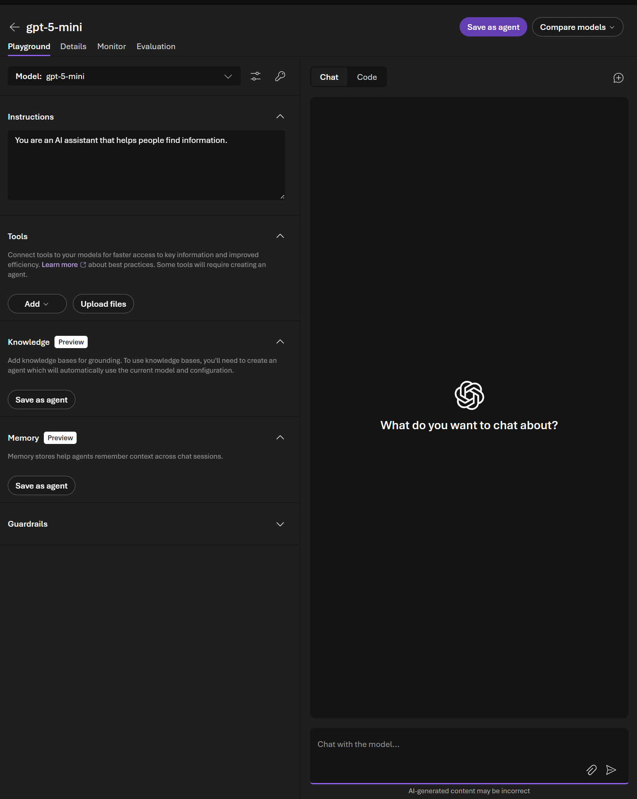
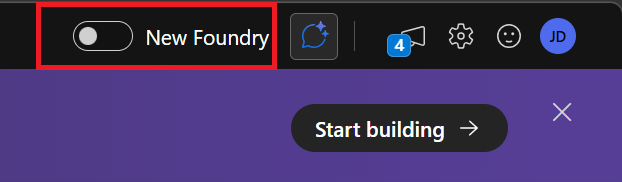

# Portal Lab 1: Models

In this lab you'll explore the Foundry model catalog, deploy a new model, and test it in the playground — all through the Foundry Portal. No code required.

← [Portal Lab 0](../portal-lab-0/README.md) | **Portal Lab 1** | [Portal Lab 2 →](../portal-lab-2/README.md)

**Expected duration**: 45 min

**Prerequisites**:

- [Portal Lab 0](../portal-lab-0/README.md) completed (environment validated, 3 models confirmed)

## 🎯 Objective

The goals for this lab are:

- Navigate the model catalog and use filters to discover models by provider, capability, and industry.
- Understand model cards: details, benchmarks, and existing deployments.
- Deploy a new model and test it in the playground with a manufacturing-themed system prompt.
- Experiment with model parameters and compare models side by side.

## 🧭 Context and Background

The Foundry Portal provides a curated **model catalog** with hundreds of models from Microsoft, OpenAI, Meta, Mistral, and other providers. Each model has a **model card** with documentation, benchmarks, and deployment options.

You already have three models deployed from the initial setup. In this lab you'll explore what's available, deploy a fourth model, and learn to test models in the **playground** before integrating them into agents or applications.

### Key concepts

| Concept | Description |
|---------|-------------|
| **Model catalog** | Searchable directory of all available models, with filters for provider, task type, and licensing |
| **Model card** | Detail page for a model: description, benchmarks, use cases, limitations, and pricing |
| **Deployment** | An instance of a model provisioned in your project, with a specific endpoint and rate limits |
| **Playground** | Interactive chat UI to test a deployed model with system prompts, parameters, and file attachments |
| **Benchmarks** | Performance comparisons across models on standardized tasks (quality, speed, cost) |

### Choosing the right model

Not all models serve the same purpose. Azure AI Foundry groups models into categories based on their strengths (see the [Model Choice Guide](https://learn.microsoft.com/en-us/azure/foundry/foundry-models/how-to/model-choice-guide)):

| Category | Examples | Best for |
|----------|----------|----------|
| **Flagship reasoning** | gpt-5, gpt-5-pro | Complex multi-step analysis, planning, agentic workflows that require deep thinking |
| **Cost-efficient reasoning** | gpt-5-mini | Everyday reasoning tasks with good quality at lower cost and faster speed |
| **Flagship standard** | gpt-4.1 | High-throughput tasks, coding, function calling, structured output — no built-in reasoning |
| **Cost-efficient standard** | gpt-4.1-mini, gpt-4.1-nano | High-volume, low-latency tasks where cost matters most |

Your project already has **gpt-4.1** (flagship standard) and **gpt-4o-mini** (cost-efficient standard) deployed. In this lab you'll deploy **gpt-5-mini** — a cost-efficient reasoning model — so you can experience the difference between standard and reasoning models firsthand.

## ✅ Tasks

### Task 1: Browse the Model Catalog

1. In the Foundry Portal, click **Discover** in the top navigation bar, then select **Models**.
2. You'll see the full model catalog (11,000+ models). Explore the available **filters** on the left:
   - **Collections**: Direct from Azure, Foundry Labs, Hugging Face, Fireworks on Foundry
   - **Capabilities**: Agent supported, Fine-tuning, Reasoning, Streaming, Tool calling
   - **Source**: Filter by model provider origin
   - **Inference tasks**: Filter by task type (Chat completion, Image to text, Audio generation, etc.)
   - **Industry**: Consumer goods, Financial services, Health and life sciences, Manufacturing, Mobility
3. Try these filter combinations and note the results:
   - Filter by **Manufacturing** industry → see models optimized for manufacturing use cases
   - Filter by **Agent supported** capability → see which models work with the Agent Service
   - Filter by **Tool calling** capability → see models that can invoke tools (important for Lab 3)

<details>
<summary>💬 What to look for</summary>

- The catalog contains models from multiple providers — not just OpenAI (notice Qwen, Mistral, DeepSeek, Grok, and others).
- Different models support different capabilities and inference tasks.
- Some models are free to try, others require specific deployment types.
- Notice the variety of model types: chat completion, audio generation, image to text, and more.

</details>

### Task 2: Explore a Model Card

1. Search for or click on **gpt-4.1** in the catalog.
2. On the model card page, explore the tabs:
   - **Details**: Key capabilities, use cases, pricing, technical specs, supported tools for agents
   - **Deployments**: See deployments already in your project (useful to avoid duplicates)
   - **Benchmarks**: Quality index, safety, latency, throughput, and estimated cost rankings
   - **Responsible AI**: Safety and fairness information
   - **License**: Model licensing terms
3. On the **Details** tab, note the key capabilities (text, image processing, JSON Mode, function calling, structured outputs).
4. Check the **Quick facts** sidebar on the Benchmarks tab — it shows model provider, type, lifecycle, input/output types, context window, and pricing link.

<details>
<summary>💬 Things to notice</summary>

- The **Quick facts** sidebar shows context window size (e.g., 1048K input / 32K output for gpt-4.1).
- The **Benchmarks** tab ranks models on 5 dimensions: Quality index, Safety (attack success rate), Latency, Throughput (tokens/sec), and Estimated cost.
- **"Others who deployed this model also used"** suggests related models worth exploring.
- The **Supported tools for agents** section on Details tells you which tools the model can use in the Agent Service.

</details>

### Task 3: Compare & Benchmark Models

1. On the gpt-4.1 **Benchmarks** tab, review the "Comparing similar model benchmarks" section.
2. You'll see ranked tables for **Quality index**, **Safety**, **Latency**, **Throughput**, and **Estimated cost** — each comparing gpt-4.1 against similar models.
3. Click the **Compare models** button to open a side-by-side comparison view.
4. Select a second model (e.g., **gpt-4o-mini** or **gpt-5-pro**) and compare benchmark scores, pricing, and capabilities.

<details>
<summary>💬 What to observe</summary>

- gpt-4.1 ranks highly on throughput (95 tokens/sec) and cost ($3.50/1M tokens) but may trail on quality index compared to larger reasoning models.
- Safety scores vary significantly — lower attack success rate is better.
- The comparison helps you make informed trade-offs: quality vs. cost vs. latency for your specific use case.

</details>

### Task 4: Deploy a New Model

You'll deploy **gpt-5-mini** — a reasoning model that "thinks before it answers." Unlike gpt-4.1 (a standard model that generates tokens immediately), gpt-5-mini uses internal chain-of-thought reasoning to work through problems step by step. This makes it better at complex analysis, planning, and troubleshooting — exactly the kind of tasks a manufacturing quality expert faces. The trade-off is that reasoning models take longer per response, but you can control this with the **Reasoning Effort** parameter.

1. Navigate to **Models** in the left navigation and search for **gpt-5-mini**.
2. Click on the model card, then click the **Deploy** button.
3. You'll see two options:
   - **Default settings** — Deploys with Global Standard and default quota. No extra configuration needed.
   - **Custom settings** — Lets you configure deployment name, deployment type, tokens per minute rate limit, and guardrails.
4. Select **Custom settings** to explore the options:
   - **Deployment name**: Leave as the suggested default (e.g., `gpt-5-mini-2`) or customize it.
   - **Deployment type**: Global Standard (pay per API call with the highest rate limits).
   - **Tokens per Minute Rate Limit**: Adjust the slider or leave the default value.
   - **Guardrails**: Leave as `DefaultV2`.
5. Click **Deploy**. You'll be taken directly to the **Playground** for the newly deployed model.

> [!TIP]
> For this lab, **Default settings** is perfectly fine. We use Custom settings here so you can see what's configurable. In production, you'd adjust rate limits and guardrails based on your workload.

<details>
<summary>✅ You should see something similar to this</summary>

After deploying, the Foundry Portal opens the model playground directly — showing the Instructions panel on the left, Tools, Knowledge, and Memory sections, and the Chat panel on the right with "What do you want to chat about?"



</detail

### Task 5: Test in the Playground

1. You should already be in the playground after deploying in Task 4. If you navigated away, go to **Build** → **Models** in the left navigation → click your deployment → select the **Playground** tab.
2. In the **Instructions** box (left panel), enter:

   ```
   You are a manufacturing quality expert at Contoso Tires. You help engineers
   diagnose tire defects, recommend quality improvements, and explain
   manufacturing processes. Be specific about machine types, part numbers,
   and procedures when possible. Use clear, structured responses.
   ```

> [!IMPORTANT]
> At this point the model has **no grounding data or tools** — it can only answer from its pre-trained knowledge. Responses may be generic or outdated because the model doesn't have access to Contoso Tires' actual machines, part numbers, or maintenance history. In **Lab 2** you'll create agents, and in **Lab 3** you'll connect tools and knowledge bases so the model can reference your real data.

> [!TIP]
> Reasoning models like gpt-5-mini default to **high** reasoning effort, which can make responses take up to 2 minutes. Before testing the prompts below, open the **Parameters** panel (click the sliders icon next to the model selector) and set **Reasoning Effort** to **low**. This gives much faster responses while still being good enough for these exercises. You'll experiment with different effort levels later in this task.
>
> 

3. In the **Chat** tab on the right, try each prompt below. Each one demonstrates a different aspect of working with a plain LLM.

**Prompt 1 — General knowledge** (model succeeds):
> "What are the most common causes of sidewall separation in radial tires, and what manufacturing process controls can prevent it?"

   The model gives a solid, detailed answer — this is general tire manufacturing knowledge that exists in its training data. LLMs excel at synthesizing publicly available domain knowledge.

**Prompt 2 — Expose the knowledge gap** (no grounding data):
> "How many work orders were opened for Contoso Tires machine TB-200 in the last quarter? Summarize the top issues reported."

   The model will either make up plausible-sounding details (hallucinate) or admit it doesn't know. This is the key limitation — without grounding (tools, knowledge bases), the model can only guess about company-specific data. In **Lab 3** you'll connect real data so it can answer accurately.

**Prompt 3 — Structured output** (prompt engineering):
> "List the top 5 tire defect types in a JSON array. Each object should have fields: defectName, severity (low/medium/high), and likelyCause."

   Notice the model follows the requested format. This is **prompt engineering** — you can control output structure through instructions alone. Try asking for a markdown table or numbered list of the same data and compare.

**Prompt 4 — System prompt influence** (change the Instructions):

   First, send this message with the current Instructions:
> "Should we replace our tire curing press or repair it? It's 12 years old with increasing downtime."

   Now change the **Instructions** box to:
   ```
   You are a cost-conscious financial analyst at Contoso Tires. Always recommend
   the most budget-friendly option. Quantify costs whenever possible. Be skeptical
   of capital expenditure proposals.
   ```
   Send the **exact same question** again and compare the two responses. Notice how the system prompt dramatically changes the model's perspective, tone, and recommendation — same model, same question, different persona.

4. Now experiment with the **Parameters** panel (click the sliders icon next to the model selector):
   - **Reasoning Effort**: Try **high** (default) vs. **minimal**. Send the same question with each setting and notice the speed difference — minimal gives near-instant responses while high takes longer but may produce more thorough analysis.
   - **Max Completion Tokens**: Reduce from the default (16384) to a low value (e.g., 200) and resend a question. Watch how the model truncates its response mid-sentence when it hits the limit.

<details>
<summary>💬 What to observe about parameters</summary>

- **Reasoning Effort** controls how much "thinking" the model does before answering. For quick factual lookups, **minimal** or **low** is fast and sufficient. For complex multi-step analysis, **high** produces more thorough responses but takes longer.
- **Max Completion Tokens** is a hard limit on response length. The model stops abruptly when it hits the cap — useful for controlling costs but can cut off important information.
- These are the parameters available for reasoning models like gpt-5-mini.

</details>

## 🚀 Go Further

> [!NOTE]
> Finished early? These optional exercises let you explore additional playground features.

### Task 6: Compare Models in Playground

1. In the playground, click the **Compare models** button in the top-right corner.
2. Select your newly deployed **gpt-5-mini** on one side and **gpt-4o-mini** on the other.
3. Set the same system prompt on both sides using the **Setup** tab.
4. Send the same question in the **Chat** tab to both models simultaneously:
   > "Create a step-by-step root cause analysis procedure for inconsistent cure times on a tire curing press."
5. Compare the responses: depth, structure, and specificity.

### Task 7: Multimodal Input (Vision)

1. In the playground, switch to a vision-capable model deployment — select **gpt-4.1** from the **Model** dropdown (gpt-4.1 supports image input).
2. In the chat input, click the **attachment** icon (paperclip) to upload an image.
3. Upload the tire defect image included in this repo: [`portal-lab-1/images/tire-defect-sample.png`](./images/tire-defect-sample.png)
   - To download: open the file on GitHub and click the **Download raw file** button (↓ icon), or download the whole repo as a ZIP (green **Code** button → **Download ZIP**).
4. Ask: "Analyze this image. What type of tire defect do you see, and what manufacturing process is most likely responsible?"
5. Observe how the model interprets visual input alongside text.

> [!TIP]
> You can also try uploading any other photo and asking the model to describe it in a manufacturing context. The goal is to experience multimodal input.

## 🛠️ Troubleshooting and FAQ

<details>
<summary>Model deployment fails with a quota error</summary>

- Your subscription may have reached its deployment quota for the region.
- Try deploying with a lower rate limit (e.g., reduce tokens-per-minute).
- Ask your coach if an alternative region or deployment type is available.

</details>

<details>
<summary>The model I want isn't in the catalog</summary>

- Not all models are available in all regions. Check the model card for supported regions.
- Some models require specific subscription types or enrollment in a preview program.

</details>

<details>
<summary>Playground responses are slow or timing out</summary>

- Try reducing the **max tokens** parameter.
- Check if the model is still provisioning (status should be "Succeeded").
- High demand on shared quota can cause temporary slowdowns.

</details>

<details>
<summary>Compare feature is not visible in the playground</summary>

- The **Compare models** button is in the top-right corner of the playground.
- If not available, you can manually open two browser tabs — one for each model — and send the same prompt in both.

</details>

## 🧠 Conclusion and Reflection

In this lab you used the **model playground** — an interactive environment for testing deployed models with instructions, parameters, and file attachments. The playground you used here is the *model-scoped* playground (accessed from a model's page). In the next lab you'll work with the *agent playground*, which adds tools, knowledge, and memory on top of a model. For more details on playground types, see [Playgrounds in Azure AI Foundry](https://learn.microsoft.com/en-us/azure/foundry/concepts/concept-playgrounds).

You learned to:
- **Discover** models through the catalog with filters and benchmarks
- **Deploy** a model to your project with a specific configuration
- **Test** models interactively in the playground with instructions and parameter tuning
- **Compare** models to understand quality, style, and cost trade-offs

**Reflect on these questions:**
- How did the model's responses change when you switched Reasoning Effort from high to minimal?
- Did the model give specific Contoso Tires machine or part details, or were responses generic? Why?
- What would the model need (data, tools, context) to give accurate, company-specific answers?

In the upcoming labs you'll address these gaps — **Lab 2** introduces agents that can maintain conversation context, and **Lab 3** and **Lab 4** connects tools and knowledge bases so the model can reference your actual maintenance data.

**Next**: [Portal Lab 2 — Agents](../portal-lab-2/README.md)
