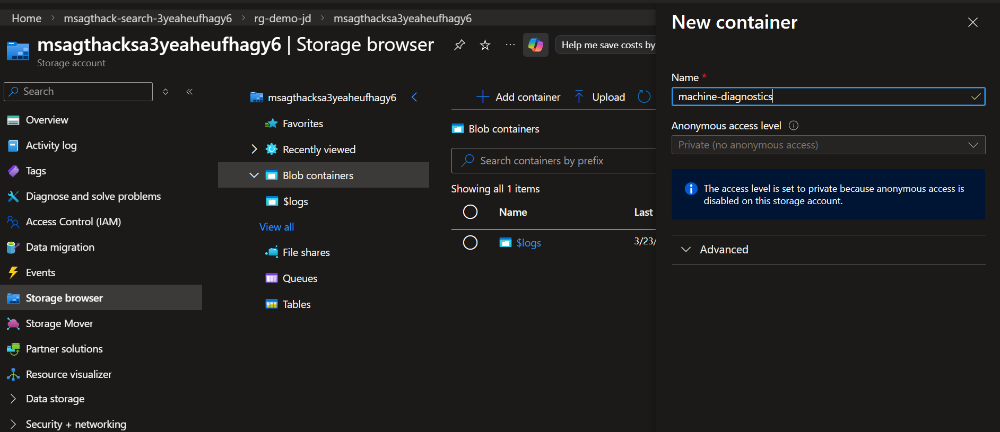
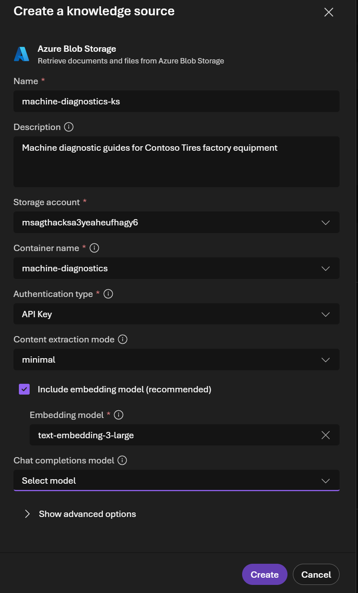
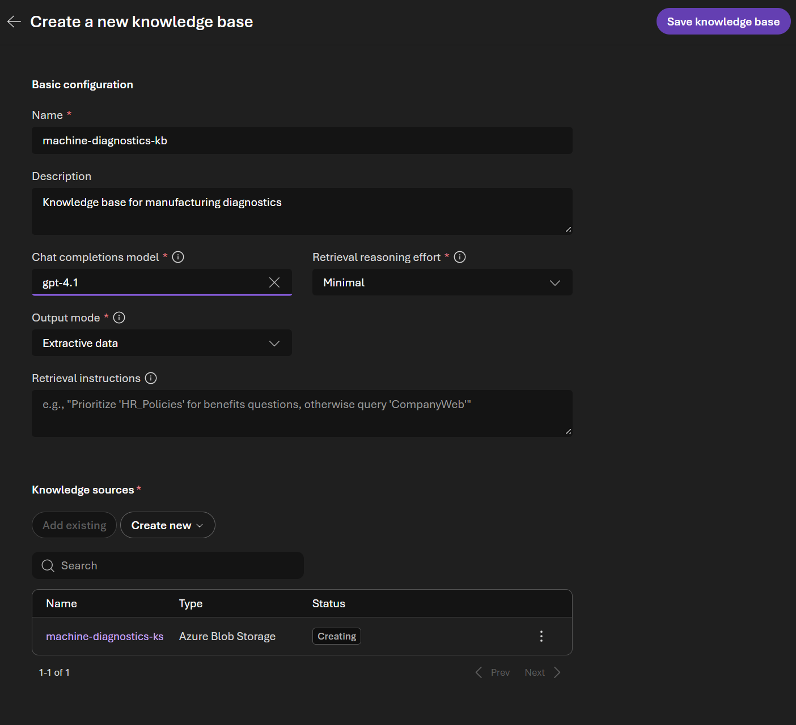
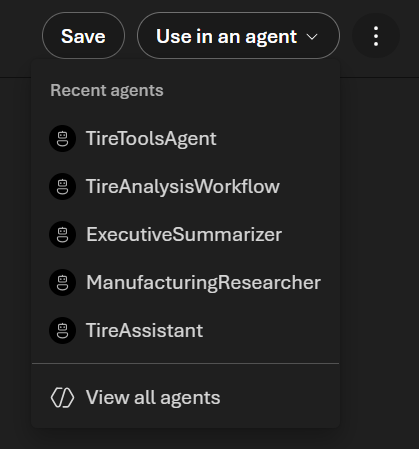
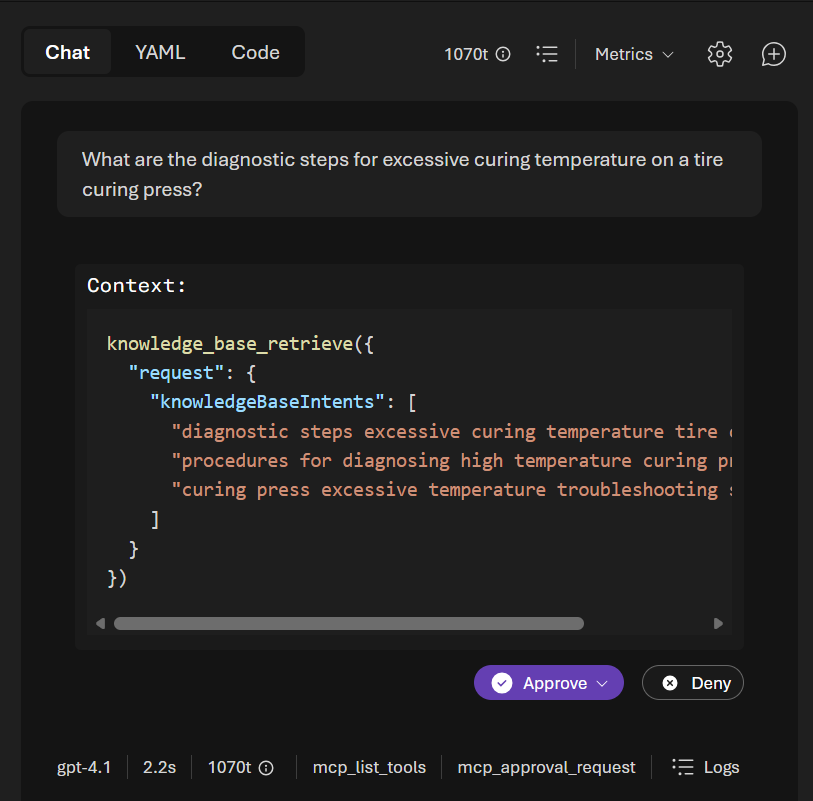

# Portal Lab 4: Foundry IQ & Enterprise Knowledge

In this lab you'll create a Foundry IQ knowledge base from your factory's diagnostic documentation, connect it to your agent, and explore how agentic retrieval differs from simple tool-based search. No code required.

← [Portal Lab 3](../portal-lab-3/README.md) | **Portal Lab 4**

**Expected duration**: 45 min

**Prerequisites**:

- [Portal Lab 3](../portal-lab-3/README.md) completed (you have a `TireToolsAgent` agent with tools enabled)
- Access to the pre-provisioned **Storage Account** in the Azure Portal (verfied in [Portal Lab 0](../portal-lab-0/README.md) )
- Lab data files downloaded to your local machine (see below)

### Download Lab Files from GitHub

This lab requires the machine diagnostic wiki files. Since you're working directly from the Foundry Portal (not in a codespace), download the files from GitHub to your local machine first.

**Option A — Download individual files:**

1. Navigate to the repository on GitHub.
2. Open the file you need (e.g. `portal-lab-4/data/kb-wiki/tire_curing_press.md`).
3. Click the **Download raw file** button (↓ icon) in the top-right of the file view.
4. Repeat for each file you need.

**Option B — Download the whole folder as a ZIP:**

1. Navigate to the repository's main page on GitHub.
2. Click the green **Code** button → **Download ZIP**.
3. Extract the ZIP and find the files under `portal-lab-4/data/`.

**Files you'll need during this lab:**

| File | Used in | Purpose |
|------|---------|---------|
| `portal-lab-4/data/kb-wiki/tire_curing_press.md` | Task 1 | Machine diagnostic guide |
| `portal-lab-4/data/kb-wiki/tire_building_machine.md` | Task 1 | Machine diagnostic guide |
| `portal-lab-4/data/kb-wiki/tire_extruder.md` | Task 1 | Machine diagnostic guide |
| `portal-lab-4/data/kb-wiki/tire_uniformity_machine.md` | Task 1 | Machine diagnostic guide |
| `portal-lab-4/data/kb-wiki/banbury_mixer.md` | Task 1 | Machine diagnostic guide |

## 🎯 Objective

The goals for this lab are:

- Understand the difference between **agent tools** (like File Search) and **RAG / Foundry IQ** for enterprise knowledge retrieval.
- Upload machine diagnostic documents to **Azure Blob Storage**.
- Create a **Foundry IQ** knowledge base and connect it to your agent.
- Test agentic retrieval with cross-document queries and verify citations.
- Explore the knowledge base directly in the **Azure AI Search** service.

## 🧭 Context and Background

In Portal Lab 3, you used **tools** like File Search, Code Interpreter, and Web Search. These are powerful, but there's an important distinction between using a tool to search a single uploaded file and using a **knowledge base** to retrieve from an enterprise-scale document collection.

### Tools vs. RAG / Foundry IQ

**Retrieval Augmented Generation (RAG)** is a pattern that combines search with large language models so responses are grounded in your data. Here's how it works:

1. **Retrieve**: When a user asks a question, the system queries an index to find relevant content.
2. **Augment**: The retrieved content is combined with the user's question into a prompt.
3. **Generate**: The model generates a response grounded in the retrieved content, with citations.

The table below compares the approaches you've seen so far:

| Approach | How it works | Best for | Limitations |
|----------|-------------|----------|-------------|
| **File Search** (tool) | Uploads file(s) to the agent, creates a vector index per agent | Quick prototyping, single documents, ad-hoc queries | Tied to one agent, no cross-agent sharing, limited scale |
| **Web Search** (tool) | Searches the live web via Bing at query time | Current events, external information | No control over sources, public data only |
| **Foundry IQ** (RAG) | Indexes documents in Azure AI Search, uses agentic retrieval with query decomposition and reranking | Enterprise knowledge bases, multi-document retrieval, shared across agents | Requires setup (storage, indexing), takes minutes to index |

### What makes Foundry IQ different?

Foundry IQ uses **agentic retrieval** — a more sophisticated approach than simple file search:

```
User question
    ↓
❶ Query decomposition — break complex questions into sub-queries
    ↓
❷ Parallel search — search across all connected knowledge sources simultaneously
    ↓
❸ Semantic reranking — score and prioritize the most relevant results
    ↓
❹ Cited response — generate an answer with inline citations to source documents
```

Key advantages over simple tool-based search:
- **Context-aware query planning** — uses conversation history to understand intent across follow-up questions.
- **Parallel execution** — runs multiple focused sub-queries simultaneously for better coverage.
- **Structured responses** — returns grounding data, citations, and execution metadata.
- **Shared knowledge** — multiple agents can share the same knowledge base.
- **Permission-aware** — can enforce access controls so agents only return authorized content.

> [!TIP]
> Learn more: [Retrieval augmented generation (RAG) and indexes](https://learn.microsoft.com/en-us/azure/foundry/concepts/retrieval-augmented-generation)

### The Three IQ Workloads

Microsoft provides three **IQ workloads** that give agents access to different aspects of your organization:

| IQ Workload | What it does | Data sources |
|-------------|-------------|-------------|
| **Foundry IQ** | Managed knowledge layer for enterprise data | Azure Blob Storage, SharePoint, OneLake, web — structured and unstructured content |
| **Fabric IQ** | Semantic intelligence layer for Microsoft Fabric | OneLake, Power BI — business data, ontologies, semantic models |
| **Work IQ** | Contextual intelligence layer for Microsoft 365 | Documents, meetings, chats, workflows — collaboration signals |

Each IQ workload is standalone, but they can be used together to give agents comprehensive organizational context. In this lab you'll work with **Foundry IQ** — the one focused on grounding agents in enterprise knowledge with permission-aware, cited responses.

> [!TIP]
> Learn more: [What is Foundry IQ?](https://learn.microsoft.com/en-us/azure/foundry/agents/concepts/what-is-foundry-iq)

## ✅ Tasks

### Task 1: Upload Wiki Files to Blob Storage

This repository includes 5 machine diagnostic guides in [`portal-lab-4/data/kb-wiki/`](./data/kb-wiki/):

| File | Content |
|------|---------|
| `tire_curing_press.md` | Curing press faults, diagnostics, corrective actions |
| `tire_building_machine.md` | Building machine vibration and tension issues |
| `tire_extruder.md` | Extruder temperature and pressure faults |
| `tire_uniformity_machine.md` | Uniformity testing and measurement issues |
| `banbury_mixer.md` | Mixing temperature and rotor faults |

You need to upload these to the pre-provisioned **Storage Account** so Foundry IQ can index them.

1. Open the [Azure Portal](https://portal.azure.com) and navigate to your resource group (e.g. `rg-foundry-demo`).
2. Open the **Storage account** (name starts with `msagthack...`).
3. In the left navigation, click **Storage browser**.
4. Expand **Blob containers**. You need to create a new container for the diagnostic files:
   - Click **+ Add container** at the top.
   - In the **Name** field, enter `machine-diagnostics`.
   - Leave **Anonymous access level** as **Private (no anonymous access)**.
   - Click **Create**.

   

5. Click on the newly created `machine-diagnostics` container to open it.
6. Click **Upload** in the toolbar at the top of the container view.
7. In the upload dialog, click **Browse for files** and select all 5 `.md` files from the `portal-lab-4/data/kb-wiki/` folder on your local machine.
8. Click **Upload**. The files should upload in seconds.
9. Verify all 5 files appear in the `machine-diagnostics` container.

### Task 2: Create a Foundry IQ Knowledge Base

Before diving in, it helps to understand the two key concepts:

| Concept | What it is |
|---------|------------|
| **Knowledge base** | A top-level container that defines how retrieval works — which model reasons over queries, what output mode to use, and what retrieval instructions to follow. A knowledge base can reference **multiple knowledge sources**. |
| **Knowledge source** | A pointer to a specific data store (Blob Storage, SharePoint, web, etc.). Each knowledge source maps to exactly one data structure. When you query a knowledge base, it fans out subqueries to all its knowledge sources and merges the results. |

Think of it this way: the **knowledge base** is the "brain" that decides how to search, and **knowledge sources** are the "libraries" it searches through. In production, you might have one knowledge base with separate sources for maintenance manuals, parts catalogs, and safety procedures — all queried together in a single request.

> [!TIP]
> Learn more: [What is a knowledge source?](https://learn.microsoft.com/en-us/azure/search/agentic-knowledge-source-overview) | [How to create a knowledge base](https://learn.microsoft.com/en-us/azure/search/agentic-retrieval-how-to-create-knowledge-base)

**Step 1 — Create the knowledge source:**

1. Go back to the **Foundry Portal** (ai.azure.com) and navigate to **Knowledge** in the left navigation (under the **Build** section). This opens the **Foundry IQ** page with two tabs: **Knowledge bases** and **Indexes**.
2. Click **Create a knowledge base**. The first dialog that opens is **Create a knowledge source** — this is where you point to your data.
3. You'll see several knowledge source types. Select **Azure Blob Storage**.
4. The **Create a knowledge source** form opens:
   - **Name**: Enter `machine-diagnostics-ks`.
   - **Description**: Enter `Machine diagnostic guides for Contoso Tires factory equipment`.
   - **Storage account**: Select your pre-provisioned storage account from the dropdown.
   - **Container name**: Select `machine-diagnostics`.
   - **Authentication type**: Change to **API Key**.
   - **Content extraction mode**: Leave as **minimal**.
   - **Include embedding model**: Leave checked (recommended). Select **Embedding model** `text-embedding-3-large`.
   - **Chat completions model**: Leave empty (you'll set this on the knowledge base in the next step).
5. Click **Create**.



**Step 2 — Create the knowledge base:**

6. After the knowledge source is created, the **Create a new knowledge base** form is shown. Configure it:
   - **Name**: Enter `machine-diagnostics-kb`.
   - **Description**: Enter `Knowledge base for manufacturing diagnostics`.
   - **Chat completions model**: Select `gpt-4.1`.
   - **Retrieval reasoning effort**: Select **Minimal** (fastest — queries all sources without LLM-driven query planning; suitable for this lab).
   - **Output mode**: Leave as **Extractive data** (returns relevant chunks from your documents).
   - **Retrieval instructions**: Leave empty for now (you can add steering instructions later to guide which sources to prioritize).
   - **Knowledge sources**: You should see `machine-diagnostics-ks` already listed with type **Azure Blob Storage** and status **Creating**.
7. Click **Save knowledge base** in the top-right.



> [!NOTE]
> Indexing may take 2–5 minutes depending on the number of files and their size. The knowledge source status will change from **Creating** to **Active** when ready. You can navigate away and come back — the indexing continues in the background.
>
> A single knowledge base can contain **multiple knowledge sources**. For example, you could later add a SharePoint source for safety procedures or a web source for live vendor documentation — all queried together when the agent retrieves information.

### Task 3: Connect Knowledge Base to Agent & Test

1. After saving the knowledge base, you'll see a **Use in an agent** dropdown button at the top of the page (next to **Save**). Click it.
2. A list of your recent agents appears. Select **TireToolsAgent**.



3. This opens the `TireToolsAgent` playground with the knowledge base already connected. You should see it listed under the **Knowledge** section in the left panel.
4. Update the agent's **Instructions** to tell it to use the knowledge base. Replace the existing instructions with:

   ```
   You are a tire manufacturing assistant at Contoso Tires.

   ## Retrieval rules
   - ALWAYS call the knowledge_base_retrieve tool before answering
     any question about machine diagnostics, fault codes, maintenance
     procedures, or repair times.
   - Base your answer ONLY on the content returned by the tool.
   - If the tool returns no relevant results, respond with:
     "I don't have that information in the maintenance documentation."

   ## Citation rules
   - For every fact you include in your answer, add an inline citation
     referencing the source document name returned by the tool,
     e.g. [tire_curing_press.md].
   - At the end of your response, list all cited sources under a
     "Sources" heading.

   ## Response format
   - Be specific about machine types, part numbers, and threshold values.
   - Structure your responses with clear numbered steps when describing
     procedures.
   ```

   > [!TIP]
   > Explicitly telling the agent to "use the knowledge base tool" and providing structured citation rules increases the chance it will actually call the tool and surface references. See [Optimize agent instructions for knowledge retrieval](https://learn.microsoft.com/en-us/azure/foundry/agents/how-to/foundry-iq-connect?tabs=foundry%2Cpython#optimize-agent-instructions-for-knowledge-retrieval) for more guidance.

5. Click **Save** to create a new agent version with the knowledge base connected.
6. Now test with documentation-grounded questions. Send Prompt 1 below.

> [!IMPORTANT]
> The first time the agent calls the knowledge base tool, you'll see an **approval prompt** showing the `knowledge_base_retrieve` call with the generated `knowledgeBaseIntents`. Click the **Approve** dropdown and select **Always approve this tool** — this prevents the approval dialog from appearing on every subsequent query.
>
> 

**💬 Sample prompts for Foundry IQ**

**Prompt 1** — Specific diagnostics:
> "What are the diagnostic steps for excessive curing temperature on a tire curing press?"

**Prompt 2** — Threshold values:
> "What is the normal vibration threshold for a tire building machine, and what happens when it's exceeded?"

**Prompt 3** — Cross-document query:
> "Compare the estimated repair times for drum bearing replacement on the tire building machine versus rotor blade replacement on the Banbury mixer."

**Prompt 4** — Specific fault lookup:
> "What are the likely causes and corrective actions for the fault type 'ply_tension_excessive'?"

7. Verify the responses:
   - Are **citations** included, showing which source document was used?
   - Do the answers match the content in the wiki markdown files?
   - Try the cross-document query (Prompt 3) — Foundry IQ should pull from multiple documents and combine the information.

**💬 How Foundry IQ works behind the scenes**

When you ask a question:
1. **Query decomposition**: The system breaks your question into targeted sub-queries.
2. **Parallel search**: Each sub-query searches across all 5 indexed documents simultaneously.
3. **Reranking**: Results are scored for relevance and the top matches are selected.
4. **Cited response**: The agent generates an answer that includes inline citations like `[tire_building_machine.md]`.

This is fundamentally different from File Search (Lab 3 Task 1), which works with individual uploaded files. Foundry IQ handles enterprise-scale knowledge bases with multiple documents and provides traceable, cited answers.

## 🚀 Go Further

> [!NOTE]
> Finished early? These optional exercises let you explore Foundry IQ in more depth.

### Task 4: Explore the Knowledge Base in Azure AI Search

In Task 2 you created a knowledge base through Foundry IQ. Behind the scenes, this created resources in your **Azure AI Search** service. In this task you'll explore those resources directly.

**Step 1 — Browse the knowledge base in Azure AI Search:**

1. Open the [Azure Portal](https://portal.azure.com) and navigate to your resource group.
2. Open the **Azure AI Search** service (name starts with `msagthack-search-...`).
3. In the left navigation, expand **Agentic retrieval** and click **Knowledge bases**.
4. You'll see your knowledge base listed with its name, knowledge source, and chat completion model (`gpt-4.1`).
5. Click on your knowledge base to open its detail page. You'll see:
   - **Basics** section with the knowledge source (status should be **Active**) and last sync time.
   - **Retrieval** section with **Reasoning effort** (Minimal) and **Retrieval instructions** — this is where you could add instructions to guide knowledge source selection and query planning.
   - **Chat completion model** — the model used for agentic retrieval (query decomposition and reranking).
   - **Output configurations** — settings for how results are returned.


**Step 2 — Test a query directly:**

1. At the bottom of the knowledge base detail page, find the **"Enter your message..."** input box.
2. Try a query directly against the knowledge base (bypassing the agent):
   > "What are the diagnostic steps for building drum vibration on a tire building machine?"
3. Observe the response — it should return structured results from the indexed documents with source references.
4. Try a cross-document query:
   > "Which machine has the longest estimated repair time for its most critical fault?"

**💬 Why explore the Search service directly?**

Understanding what's behind Foundry IQ helps you:
- **Debug** issues when the agent doesn't return expected results — is the content indexed? Is the query finding it?
- **Tune** retrieval by adjusting reasoning effort, retrieval instructions, or output configurations.
- **Verify** that your knowledge sources are synced and active.
- **Compare** the raw retrieval results with what the agent returns — this shows you how much the agent adds through its instructions and conversation context.

> [!TIP]
> You can also explore **Knowledge sources** (under Agentic retrieval) to see the blob storage connection details, and **Indexes** (under Search management) to see the underlying search index created by Foundry IQ.

### Task 5: Compare File Search vs. Foundry IQ

Now that you've used both approaches, compare them side by side with the same question.

1. Make sure your agent still has **File Search** enabled (with the maintenance manual from Lab 3) **and** the Foundry IQ knowledge base connected.
2. Ask a question that both sources can answer:
   > "What are the steps for replacing heating elements on the tire curing press?"
3. Check the **Traces** tab to see which tool the agent used — `file_search` or the knowledge base MCP tool.
4. Now try a question only the knowledge base can answer (not in the PDF):
   > "What is the normal drum vibration threshold for a tire building machine?"
5. Observe:
   - Does the agent pick the right source for each question?
   - Are there differences in citation format between File Search and Foundry IQ?
   - Which response feels more comprehensive?

**💬 What to observe**

- **File Search** works well for the uploaded maintenance manual PDF — it's fast and simple.
- **Foundry IQ** shines when you need to search across multiple documents, get cited answers, and share the knowledge base across agents.
- In production, you'd typically use Foundry IQ for your core enterprise knowledge and File Search for ad-hoc document uploads.

## 🛠️ Troubleshooting and FAQ

**Foundry IQ indexing seems stuck**

- Indexing 5 small markdown files should complete in 2–5 minutes.
- If you get an error like *"Unable to retrieve blob container... using your managed identity"*, change the **Authentication type** to **API Key** and try again.
- If stuck beyond 10 minutes, verify the 5 `.md` files are actually in the `machine-wiki` container (go to Storage browser and check).
- Try deleting the knowledge base and recreating it with the connection.

**Citations don't appear in agent responses**

- Not all question types trigger citations. Try asking a very specific factual question: "What is the normal drum vibration threshold for a tire building machine?"
- Check that the knowledge base shows as "Connected" or "Active" on the agent.
- Make sure the agent instructions explicitly say to "use the knowledge base tool" and "include citations."
- Some models follow citation instructions more reliably than others — try switching to gpt-4.1.

**Agent doesn't use the knowledge base**

- Verify the knowledge base is connected under the **Knowledge** section (not Tools).
- Update the agent instructions to explicitly say: "Use the knowledge base tool to answer user questions."
- Check the **Traces** tab — if you don't see a knowledge base tool call, the agent is relying on its training data instead.
- Try a question that clearly requires document knowledge: "What is the exact part number for the tire curing press heating element?"

**Error: "too_many_requests: Too Many Requests"**

- This means the model deployment has hit its rate limit (tokens per minute).
- **Quick fix**: Switch the agent to a different model. Edit the **Model** dropdown and select another deployment (e.g. switch from `gpt-4.1` to `gpt-4o-mini`, or vice versa).
- Wait 30–60 seconds before retrying — rate limits reset quickly.
- If the error persists across all models, reduce your prompt size or wait a few minutes before continuing.

## 🧠 Conclusion and Reflection

In this lab you learned to:
- **Upload data** to Azure Blob Storage for indexing
- **Create a knowledge base** in Foundry IQ from blob storage content
- **Connect** the knowledge base to an agent with optimized instructions
- **Understand the difference** between tool-based search (File Search) and enterprise RAG (Foundry IQ)
- **Explore** the underlying Azure AI Search resources and test queries directly

The key takeaway is when to use each approach:
- **File Search**: Quick, per-agent document uploads — great for prototyping and ad-hoc queries.
- **Foundry IQ**: Enterprise knowledge bases with agentic retrieval — multi-document, cross-agent, permission-aware, with citations.

---

## 🎉 Congratulations!

You've completed all five Portal Labs. Here's what you've accomplished:

| Lab | What you learned |
|-----|-----------------|
| **Portal Lab 0** | Validated your environment and confirmed resource access |
| **Portal Lab 1** | Discovered, deployed, and tested models in the playground |
| **Portal Lab 2** | Created agents with memory and built multi-agent workflows |
| **Portal Lab 3** | Extended agents with tools: File Search, Code Interpreter, Web Search |
| **Portal Lab 4** | Built an enterprise knowledge base with Foundry IQ and agentic retrieval |

All of this was done through the Foundry Portal — no code required. These same capabilities can also be accessed programmatically through the Foundry SDK (Python, .NET) as demonstrated in Challenges 1–4 of this hackathon.

> [!TIP]
> Interested in the code-first approach? Check out [Challenge 1](../challenge-1/README.md) to see how to build agents programmatically in Python, or [Challenge 2](../challenge-2/README.md) for the .NET/C# approach.
